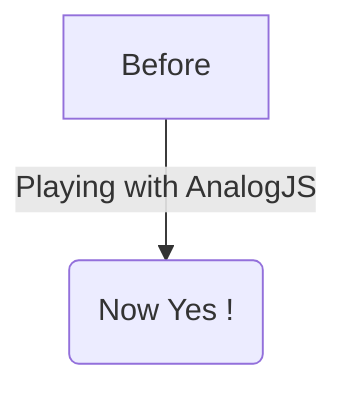

import Contributing, { toc as ContributingToc } from '../../../CONTRIBUTING.md';

<Contributing />

<!-- Workaround for generating table of contents -->
<!-- See https://github.com/facebook/docusaurus/issues/3915#issuecomment-896193142 -->

export const toc = [...ContributingToc];

---

# Open Graph (OG) Image Generation

URL: https://analogjs.org/docs/features/api/og-image-generation
import Tabs from '@theme/Tabs';
import TabItem from '@theme/TabItem';

# Open Graph (OG) Image Generation

Open Graph images can be used to display previews of pages when shared on social media sites such as Twitter/X, LinkedIn, Facebook, etc. Analog supports generating Open Graph images using [API Routes](./overview).

## Setup

First, install the necessary [satori](https://github.com/vercel/satori) dependencies:

<Tabs groupId="package-manager">
  <TabItem value="npm">

```shell
npm install satori satori-html sharp --save
```

  </TabItem>

  <TabItem label="Yarn" value="yarn">

```shell
yarn add satori satori-html sharp
```

  </TabItem>

  <TabItem value="pnpm">

```shell
pnpm install -w satori satori-html sharp
```

  </TabItem>
</Tabs>

## Setting Up An API Route

Next, define an API route in the `src/server/routes/api` directory.

```ts
// src/server/routes/api/v1/og-images.ts
import { ImageResponse } from '@analogjs/content/og';

export default defineEventHandler(async event => {
  const fontFile = await fetch('https://og-playground.vercel.app/inter-latin-ext-700-normal.woff');
  const fontData: ArrayBuffer = await fontFile.arrayBuffer();
  const query = getQuery(event); // query params

  const template = `
    <div tw="bg-gray-50 flex w-full h-full items-center justify-center">
        <div tw="flex flex-col md:flex-row w-full py-12 px-4 md:items-center justify-between p-8">
          <h2 tw="flex flex-col text-3xl sm:text-4xl font-bold tracking-tight text-gray-900 text-left">
            <span>${query['title'] ? `${query['title']}` : 'Hello World'}</span>
          </h2>
        </div>
      </div>    
  `;

  return new ImageResponse(template, {
    debug: true, // disable caching
    fonts: [
      {
        name: 'Inter Latin',
        data: fontData,
        style: 'normal',
      },
    ],
  });
});
```

- The API route uses the `ImageResponse` class from the `@analogjs/content/og` sub-package.
- Provide HTML that is rendered to a png.
- Tailwind class are supported, and optional.

## Adding Open Graph Metadata

Open Graph images are registered through meta tags inside the HTML `head` tag.

```html
<html>
  <head>
    <meta property="og:image" content="https://your-url.com/api/v1/og-images?title=Developer" />
    <meta
      name="twitter:image"
      content="https://your-url.com/api/v1/og-images?title=Developer"
      key="twitter:image"
    />
    ...
  </head>
</html>
```

The meta tags can be set manually in the `index.html` or dynamically using [Route Metadata](/docs/features/routing/metadata#open-graph-meta-tags)

---

# API Routes

URL: https://analogjs.org/docs/features/api/overview

# API Routes

Analog supports defining API routes that can be used to serve data to the application.

## Defining an API Route

API routes are defined in the `src/server/routes/api` folder. API routes are also filesystem based, and are exposed under the default `/api` prefix.

```ts
import { defineEventHandler } from 'h3';

export default defineEventHandler(() => ({ message: 'Hello World' }));
```

## Defining XML Content

To create an RSS feed for your site, set the `content-type` to be `text/xml` and Analog serves up the correct content type for the route.

```ts
//server/routes/api/rss.xml.ts

import { defineEventHandler, setHeader } from 'h3';
export default defineEventHandler(event => {
  const feedString = `<?xml version="1.0" encoding="UTF-8"?>
<rss version="2.0">
</rss>
  `;
  setHeader(event, 'content-type', 'text/xml');
  return feedString;
});
```

**Note:** For SSG content, set Analog to prerender an API route to make it available as prerendered content:

```ts
// vite.config.ts
...
prerender: {
  routes: async () => {
    return [
      ...
      '/api/rss.xml',
      ...
      .
    ];
  },
  sitemap: {
    host: 'https://analog-blog.netlify.app',
  },
},
```

The XML is available as a static XML document at `/dist/analog/public/api/rss.xml`

## Dynamic API Routes

Dynamic API routes are defined by using the filename as the route path enclosed in square brackets. Parameters can be accessed via `event.context.params`.

```ts
// /server/routes/api/v1/hello/[name].ts
import { defineEventHandler } from 'h3';

export default defineEventHandler(event => `Hello ${event.context.params?.['name']}!`);
```

Another way to access route parameters is by using the `getRouterParam` function.

```ts
// /server/routes/api/v1/hello/[name].ts
import { defineEventHandler, getRouterParam } from 'h3';

export default defineEventHandler(event => {
  const name = getRouterParam(event, 'name');
  return `Hello, ${name}!`;
});
```

## Specific HTTP request method

File names can be suffixed with `.get`, `.post`, `.put`, `.delete`, etc. to match the specific HTTP request method.

### GET

```ts
// /server/routes/api/v1/users/[id].get.ts
import { defineEventHandler, getRouterParam } from 'h3';

export default defineEventHandler(async event => {
  const id = getRouterParam(event, 'id');
  // TODO: fetch user by id
  return `User profile of ${id}!`;
});
```

### POST

```ts
// /server/routes/api/v1/users.post.ts
import { defineEventHandler, readBody } from 'h3';

export default defineEventHandler(async event => {
  const body = await readBody(event);
  // TODO: Handle body and add user
  return { updated: true };
});
```

The [h3 JSDocs](https://www.jsdocs.io/package/h3#package-index-functions) provide more info and utilities, including readBody.

## Requests with Query Parameters

Sample query `/api/v1/query?param1=Analog&param2=Angular`

```ts
// routes/api/v1/query.ts
import { defineEventHandler, getQuery } from 'h3';

export default defineEventHandler(event => {
  const { param1, param2 } = getQuery(event);
  return `Hello, ${param1} and ${param2}!`;
});
```

## Catch-all Routes

Catch-all routes are helpful for fallback route handling.

```ts
// routes/api/[...].ts
export default defineEventHandler(event => `Default page`);
```

## Error Handling

If no errors are thrown, a status code of 200 OK will be returned. Any uncaught errors will return a 500 Internal Server Error HTTP Error.
To return other error codes, throw an exception with createError

```ts
// routes/api/v1/[id].ts
import { defineEventHandler, getRouterParam, createError } from 'h3';

export default defineEventHandler(event => {
  const param = getRouterParam(event, 'id');
  const id = parseInt(param ? param : '');
  if (!Number.isInteger(id)) {
    throw createError({
      statusCode: 400,
      statusMessage: 'ID should be an integer',
    });
  }
  return `ID is ${id}`;
});
```

## Accessing Cookies

Analog allows setting and reading cookies in your server-side calls.

### Setting cookies

```ts
//(home).server.ts
import { setCookie } from 'h3';
import { PageServerLoad } from '@analogjs/router';

import { Product } from '../products';

export const load = async ({ fetch, event }: PageServerLoad) => {
  setCookie(event, 'products', 'loaded'); // setting the cookie
  const products = await fetch<Product[]>('/api/v1/products');

  return {
    products: products,
  };
};
```

### Reading cookies

```ts
//index.server.ts
import { parseCookies } from 'h3';
import { PageServerLoad } from '@analogjs/router';

export const load = async ({ event }: PageServerLoad) => {
  const cookies = parseCookies(event);

  console.log('products cookie', cookies['products']);

  return {
    shipping: true,
  };
};
```

## More Info

API routes are powered by [Nitro](https://nitro.unjs.io/guide/routing) and [h3](https://h3.unjs.io/). See the Nitro and h3 docs for more examples around building API routes.

---

# WebSocket

URL: https://analogjs.org/docs/features/api/websockets

# WebSocket

Analog also supports `WebSockets` and `Server-Sent Events` through Nitro.

## Enabling WebSockets

Currently, WebSocket support in [Nitro](https://nitro.unjs.io/guide/websocket) is experimental and it can be enabled in the `analog` plugin:

`vite.config.ts`

```typescript
import { defineConfig } from 'vite';
import analog from '@analogjs/platform';

export default defineConfig({
  // ...
  plugins: [
    analog({
      // ...
      nitro: {
        experimental: {
          websocket: true,
        },
      },
    }),
  ],
  // ...
});
```

**Note:** In development, the Vite HMR WebSocket server runs on the same port as the dev server by default. To prevent conflicts, you need to change this port. The dev server port is usually defined in `project.json`/`angular.json`, which takes precedence over `vite.config.ts`. To allow the port settings in `vite.config.ts` to take effect, remove the port definition from `project.json`/`angular.json`. Additionally, you can specify an optional path to easily differentiate connections in the browser dev tools:

`vite.config.ts`

```typescript
import { defineConfig } from 'vite';
import analog from '@analogjs/platform';

export default defineConfig({
  // ...
  server: {
    port: 3000, // dev-server port
    hmr: {
      port: 3002, // hmr ws port
      path: 'vite-hmr', // optional
    },
  },
  // ...
});
```

## Defining a WebSocket Handler

Similar to [API routes](/docs/features/api/overview), WebSocket Handlers are defined in the `src/server/routes/api` folder.

```typescript
// src/server/api/routes/ws/chat.ts
import { defineWebSocketHandler } from 'h3';

export default defineWebSocketHandler({
  open(peer) {
    peer.send({ user: 'server', message: `Welcome ${peer}!` });
    peer.publish('chat', { user: 'server', message: `${peer} joined!` });
    peer.subscribe('chat');
  },
  message(peer, message) {
    if (message.text().includes('ping')) {
      peer.send({ user: 'server', message: 'pong' });
    } else {
      const msg = {
        user: peer.toString(),
        message: message.toString(),
      };
      peer.send(msg); // echo
      peer.publish('chat', msg);
    }
  },
  close(peer) {
    peer.publish('chat', { user: 'server', message: `${peer} left!` });
  },
});
```

### WebSocket Routes

WebSocket routes are exposed with the same path as API routes. For example, `src/server/routes/api/ws/chat` is exposed as `ws://example.com/api/ws/chat`.

## Defining a Server-sent Event Handler

Server-sent event handlers can be created using `createEventStream` function in the event handler.

```typescript
// src/server/routes/api/sse.ts
import { defineEventHandler, createEventStream } from 'h3';

export default defineEventHandler(async event => {
  const eventStream = createEventStream(event);

  const interval = setInterval(async () => {
    await eventStream.push(`Message @ ${new Date().toLocaleTimeString()}`);
  }, 1000);

  eventStream.onClosed(async () => {
    clearInterval(interval);
    await eventStream.close();
  });

  return eventStream.send();
});
```

## More Info

WebSockets are powered by [Nitro](https://nitro.unjs.io/guide/websocket), [h3](https://h3.unjs.io/guide/websocket) and [crossws](https://crossws.unjs.io/guide). See the Nitro, h3 and crossws docs for more details.

---

# Overview

URL: https://analogjs.org/docs/features/data-fetching/overview

# Overview

Data fetching in Analog builds on top of concepts in Angular, such as using `HttpClient` for making API requests.

## Using HttpClient

Using `HttpClient` is the recommended way to make API requests for internal and external endpoints. The context for the request is provided by the `provideServerContext` function for any request that uses `HttpClient` and begins with a `/`.

## Server Request Context

On the server, use the `provideServerContext` function from the Analog router in the `main.server.ts`.

```ts
import 'zone.js/node';
import { enableProdMode } from '@angular/core';
import { bootstrapApplication } from '@angular/platform-browser';
import { renderApplication } from '@angular/platform-server';

// Analog server context
import { provideServerContext } from '@analogjs/router/server';
import { ServerContext } from '@analogjs/router/tokens';

import { config } from './app/app.config.server';
import { AppComponent } from './app/app.component';

if (import.meta.env.PROD) {
  enableProdMode();
}

export function bootstrap() {
  return bootstrapApplication(AppComponent, config);
}

export default async function render(url: string, document: string, serverContext: ServerContext) {
  const html = await renderApplication(bootstrap, {
    document,
    url,
    platformProviders: [provideServerContext(serverContext)],
  });

  return html;
}
```

This provides the `Request` and `Response`, and `Base URL` from the server and registers them as providers that can be injected and used.

## Injection Functions

```ts
import { inject } from '@angular/core';
import { injectRequest, injectResponse, injectBaseURL } from '@analogjs/router/tokens';

class MyService {
  request = injectRequest(); // <- Server Request Object
  response = injectResponse(); // <- Server Response Object
  baseUrl = injectBaseURL(); // <-- Server Base URL
}
```

## Request Context Interceptor

Analog also provides `requestContextInterceptor` for the HttpClient that handles transforming any request to URL beginning with a `/` to a full URL request on the server, client, and during prerendering.

Use it with the `withInterceptors` function from the `@angular/common/http` packages.

```ts
import { provideHttpClient, withFetch, withInterceptors } from '@angular/common/http';
import { ApplicationConfig } from '@angular/core';
import { provideClientHydration } from '@angular/platform-browser';
import { provideFileRouter, requestContextInterceptor } from '@analogjs/router';
import { withNavigationErrorHandler } from '@angular/router';

export const appConfig: ApplicationConfig = {
  providers: [
    provideFileRouter(withNavigationErrorHandler(console.error)),
    provideHttpClient(withFetch(), withInterceptors([requestContextInterceptor])),
    provideClientHydration(),
  ],
};
```

> Make sure the `requestContextInterceptor` is **last** in the array of interceptors.

## Making Requests

In your component/service, use `HttpClient` along with [API routes](/docs/features/api/overview) with providing a full URL.

An example API route that fetches todos.

```ts
// src/server/routes/api/v1/todos.ts -> /api/v1/todos
import { eventHandler } from 'h3';

export default eventHandler(async () => {
  const response = await fetch('https://jsonplaceholder.typicode.com/todos');
  const todos = await response.json();

  return todos;
});
```

An example service that fetches todos from the API endpoint.

```ts
// todos.service.ts
import { Injectable, inject } from '@angular/core';
import { HttpClient } from '@angular/common/http';

import { Todo } from './todos';

@Injectable({
  providedIn: 'root',
})
export class TodosService {
  http = inject(HttpClient);

  getAll() {
    return this.http.get<Todo[]>('/api/v1/todos');
  }

  getData() {
    return this.http.get<Todo[]>('/assets/data.json');
  }
}
```

Data requests also use Angular's `TransferState` to store any requests made during Server-Side Rendering, and are transferred to prevent an additional request during the initial client-side hydration.

---

# Server-Side Data Fetching

URL: https://analogjs.org/docs/features/data-fetching/server-side-data-fetching

# Server-Side Data Fetching

Analog supports fetching data from the server before loading a page. This can be achieved by defining an async `load` function in `.server.ts` file of the page.

## Fetching the Data

To fetch the data from the server, create a `.server.ts` file that contains the async `load` function alongside the `.page.ts` file.

```ts
// src/app/pages/index.server.ts
import { PageServerLoad } from '@analogjs/router';

export const load = async ({
  params, // params/queryParams from the request
  req, // H3 Request
  res, // H3 Response handler
  fetch, // internal fetch for direct API calls,
  event, // full request event
}: PageServerLoad) => {
  return {
    loaded: true,
  };
};
```

## Injecting the Data

Accessing the data fetched on the server can be done using the `injectLoad` function provided by `@analogjs/router`.
The `load` function is resolved using Angular route resolvers, so setting `requireSync: false` and `initialValue: {}` offers no advantage, as load is fetched before the component is instantiated.

```ts
// src/app/pages/index.page.ts
import { Component } from '@angular/core';
import { toSignal } from '@angular/core/rxjs-interop';
import { injectLoad } from '@analogjs/router';

import { load } from './index.server'; // not included in client build

@Component({
  standalone: true,
  template: `
    <h2>Home</h2>

    Loaded: {{ data().loaded }}
  `,
})
export default class BlogComponent {
  data = toSignal(injectLoad<typeof load>(), { requireSync: true });
}
```

Accessing the data can also be done with Component Inputs and Component Input Bindings provided in the Angular Router configuration. To configure the Angular Router for `Component Input Bindings`, add `withComponentInputBinding()` to the arguments passed to `provideFileRouter()` in the `app.config.ts`.

```ts
import { provideHttpClient } from '@angular/common/http';
import { ApplicationConfig } from '@angular/core';
import { provideClientHydration } from '@angular/platform-browser';
import { provideFileRouter } from '@analogjs/router';
import { withNavigationErrorHandler } from '@angular/router';

export const appConfig: ApplicationConfig = {
  providers: [
    provideFileRouter(withComponentInputBinding(), withNavigationErrorHandler(console.error)),
    provideHttpClient(),
    provideClientHydration(),
  ],
};
```

Now to get the data in the component add an input called `load`.

```ts
// src/app/pages/index.page.ts
import { Component } from '@angular/core';
import { LoadResult } from '@analogjs/router';

import { load } from './index.server'; // not included in client build

@Component({
  standalone: true,
  template: `
    <h2>Home</h2>
    Loaded: {{ data.loaded }}
  `,
})
export default class BlogComponent {
  @Input() load(data: LoadResult<typeof load>) {
    this.data = data;
  }

  data!: LoadResult<typeof load>;
}
```

## Accessing to the server load data

Accessing to the server load data from `RouteMeta` resolver can be done using the `getLoadResolver` function provided by `@analogjs/router`.

```ts
import { getLoadResolver } from '@analogjs/router';

export const routeMeta: RouteMeta = {
  resolve: {
    data: async route => {
      // call server load resolver for this route from another resolver
      const data = await getLoadResolver(route);

      return { ...data };
    },
  },
};
```

## Overriding the Public Base URL

Analog automatically infers the public base URL to be set when using the server-side data fetching through its [Server Request Context](/docs/features/data-fetching/overview#server-request-context) and [Request Context Interceptor](/docs/features/data-fetching/overview#request-context-interceptor). To explcitly set the base URL, set an environment variable, using a `.env` file to define the public base URL.

```
// .env
VITE_ANALOG_PUBLIC_BASE_URL="http://localhost:5173"
```

The environment variable must also be set when building for deployment.

---

# Deployment

URL: https://analogjs.org/docs/features/deployment/overview
import Tabs from '@theme/Tabs';
import TabItem from '@theme/TabItem';

# Deployment

Node.js deployment is the default Analog output preset for production builds.

When running `npm run build` with the default preset, the result will be an entry point that launches a ready-to-run Node server.

To start up the standalone server, run:

```bash
$ node dist/analog/server/index.mjs
Listening on http://localhost:3000
```

### Environment Variables

You can customize server behavior using following environment variables:

- `NITRO_PORT` or `PORT` (defaults to `3000`)
- `NITRO_HOST` or `HOST`

## Built-in Presets

Analog can generate different output formats suitable for different [hosting providers](/docs/features/deployment/providers) from the same code base, you can change the deploy preset using an environment variable or `vite.config.ts`.

Using environment variable is recommended for deployments depending on CI/CD.

**Example:** Using `BUILD_PRESET`

```bash
BUILD_PRESET=node-server
```

**Example:** Using `vite.config.ts`

```ts
import { defineConfig } from 'vite';

export default defineConfig({
  plugins: [
    analog({
      nitro: {
        preset: 'node-server',
      },
    }),
  ],
});
```

## Deploying with a Custom URL Prefix

If you are deploying with a custom URL prefix, such as https://domain.com/ `basehref` you must do these steps for [server-side-data-fetching](https://analogjs.org/docs/features/data-fetching/server-side-data-fetching), [html markup and assets](https://angular.io/api/common/APP_BASE_HREF), and [dynamic api routes](https://analogjs.org/docs/features/api/overview) to work correctly on the specified `basehref`.

1. Update your `vite.config.ts` file.

```ts
export default defineConfig(({ mode }) => ({
  base: '/basehref',
  plugins: [
    analog({
      ...(mode === 'production' ? { apiPrefix: 'basehref' } : { apiPrefix: 'basehref/api' }),
      prerender: {
        routes: async () => {
          return [];
        },
      },
    }),
  ],
}));
```

2. Update the `app.config.ts` file.

This instructs Angular on how recognize and generate URLs.

```ts
import { ApplicationConfig } from '@angular/core';
import { APP_BASE_HREF } from '@angular/common';

export const appConfig: ApplicationConfig = {
  providers: [
    [{ provide: APP_BASE_HREF, useValue: import.meta.env.BASE_URL || '/' }],
    ...
  ],
};
```

3. HttpClient use `injectAPIPrefix()`.

```ts
const response = await firstValueFrom(
  this.httpClient.get<{ client: string }>(`${injectAPIPrefix()}/v1/hello`)
);
```

4. In CI production build

**Do not** set `VITE_ANALOG_PUBLIC_BASE_URL` it should use what is in `vite.config.ts`.
If `VITE_ANALOG_PUBLIC_BASE_URL` is present during build, ssr data will be refetched on server and client.

```bash
  # if using nx:
  npx nx run appname:build:production
  # if using angular build directly:
  npx vite build && NITRO_APP_BASE_URL='/basehref/' node dist/analog/server/index.mjs
```

5. In production containers specify the env flag `NITRO_APP_BASE_URL`.

```bash
NITRO_APP_BASE_URL="/basehref/"
```

6. Preview locally:

```bash
npx vite build && NITRO_APP_BASE_URL='/basehref/' node dist/analog/server/index.mjs
```

---

# Providers

URL: https://analogjs.org/docs/features/deployment/providers
import Tabs from '@theme/Tabs';
import TabItem from '@theme/TabItem';

# Providers

Analog supports deployment to many providers with little or no additional configuration using [Nitro](https://nitro.unjs.io) as its underlying server engine. You can find more providers in the [Nitro deployment docs](https://nitro.unjs.io/deploy).

## Zerops

:::info
[Zerops](https://zerops.io) is the **official** deployment partner for AnalogJS.
:::

Analog supports deploying both static and server-side rendered apps to [Zerops](https://zerops.io) with a simple configuration file.

> One Zerops project can contain multiple Analog projects. See example repositories for [static](https://github.com/zeropsio/recipe-analog-static) and [server-side rendered](https://github.com/zeropsio/recipe-analog-nodejs) Analog apps for a quick start.

### Static (SSG) Analog app

If your project is not SSG Ready, set up your project for [Static Site Generation](/docs/features/server/static-site-generation).

#### 1. Create a project in Zerops

Projects and services can be added either through a [Project add](https://app.zerops.io/dashboard/project-add) wizard or imported using a YAML structure:

```yml
project:
  name: recipe-analog
services:
  - hostname: app
    type: static
```

This creates a project called `recipe-analog` with a Zerops Static service called `app`.

#### 2. Add zerops.yml configuration

To tell Zerops how to build and run your site, add a `zerops.yml` to your repository:

```yml
zerops:
  - setup: app
    build:
      base: nodejs@20
      buildCommands:
        - pnpm i
        - pnpm build
      deployFiles:
        - public
        - dist/analog/public/~
    run:
      base: static
```

#### 3. [Trigger the build & deploy pipeline](#build--deploy-your-code)

### Server-side rendered (SSR) Analog app

If your project is not SSR Ready, set up your project for [Server Side Rendering](/docs/features/server/server-side-rendering).

#### 1. Create a project in Zerops

Projects and services can be added either through a [Project add](https://app.zerops.io/dashboard/project-add) wizard or imported using a YAML structure:

```yml
project:
  name: recipe-analog
services:
  - hostname: app
    type: nodejs@20
```

This creates a project called `recipe-analog` with a Zerops Node.js service called `app`.

#### 2. Add zerops.yml configuration

To tell Zerops how to build and run your site, add a `zerops.yml` to your repository:

```yml
zerops:
  - setup: app
    build:
      base: nodejs@20
      buildCommands:
        - pnpm i
        - pnpm build
      deployFiles:
        - public
        - node_modules
        - dist
    run:
      base: nodejs@20
      ports:
        - port: 3000
          httpSupport: true
      start: node dist/analog/server/index.mjs
```

#### 3. [Trigger the build & deploy pipeline](#build-deploy-your-code)

---

### Build & deploy your code

#### Trigger the pipeline by connecting the service with your GitHub / GitLab repository

Your code can be deployed automatically on each commit or a new tag by connecting the service with your GitHub / GitLab repository. This connection can be set up in the service detail.

#### Trigger the pipeline using Zerops CLI (zcli)

You can also trigger the pipeline manually from your terminal or your existing CI/CD by using Zerops CLI.

1. Install the Zerops CLI.

```bash
# To download the zcli binary directly,
# use https://github.com/zeropsio/zcli/releases
npm i -g @zerops/zcli
```

2. Open [Settings > Access Token Management](https://app.zerops.io/settings/token-management) in the Zerops app and generate a new access token.

3. Log in using your access token with the following command:

```bash
zcli login <token>
```

4. Navigate to the root of your app (where `zerops.yml` is located) and run the following command to trigger the deploy:

```bash
zcli push
```

#### Trigger the pipeline using GitHub / Gitlab

You can also check out [Github Integration](https://docs.zerops.io/references/github-integration) / [Gitlab Integration](https://docs.zerops.io/references/gitlab-integration) in [Zerops Docs](https://docs.zerops.io/) for git integration.

## Netlify

Analog supports deploying on [Netlify](https://netlify.com/) with no additional configuration.

### Deploying the project

<Tabs groupId="porject-type">
  <TabItem label="Create analog" value="create-analog">
Configuration is easiest when using [Netlify CLI](https://developers.netlify.com/cli/).
    
1. Start by running this command:

```bash
npx netlify init
```

If this is a new Netlify project, you'll be prompted to initialize it; build settings will be automatically configured in a `netlify.toml` file.

2. Deploy your app:

```bash
npx netlify deploy
```

#### Manual configuration

Alternatively, you can configure your project's build settings in the Netlify app.

Set the [publish directory](https://docs.netlify.com/configure-builds/overview/#definitions) to `dist/analog/public` to deploy the static assets and the [functions directory](https://docs.netlify.com/configure-builds/overview/#definitions) to `netlify/functions` to deploy the server.
</TabItem>

  <TabItem label="Nx" value="nx">
In the build settings of your Netlify project on the web UI, do the following.
1. Set the [build command](https://docs.netlify.com/configure-builds/overview/#definitions) to `nx build [your-project-name]`
2. Set the [publish directory](https://docs.netlify.com/configure-builds/overview/#definitions) to `dist/[your-project-name]/analog/public` to deploy the static assets
3. Set the [functions directory](https://docs.netlify.com/configure-builds/overview/#definitions) to `dist/[your-project-name]/analog` to deploy the server.

You can also configure this by putting a `netlify.toml` at the root of your repository. Below is an example config.

```toml
# replace "my-analog-app" with the name of the app you want to deploy
[build]
  command = "nx build my-analog-app"
  publish = "dist/my-analog-app/analog/public"
  functions = "dist/my-analog-app/analog"
```

  </TabItem>
</Tabs>

## Vercel

Analog supports deploying on [Vercel](https://vercel.com/) with no additional configuration.

### Deploying the Project

<Tabs groupId="porject-type">
  <TabItem label="Create analog" value="create-analog">
By default, when deploying to Vercel, the build preset is handled automatically.

1. Create a new project and select the repository that contains your code.

2. Click 'Deploy'.

And that's it!

  </TabItem>

  <TabItem label="Nx" value="nx">
In order to make it work with Nx, we need to define the specific app we want to build. There are several ways to do this, and you can choose one of the following methods (replace &#60;app&#62; with your app name):

1. Define the `defaultProject` in your `nx.json`

```json [nx.json]
{
  "defaultProject": "<app>"
}
```

2. Create a `vercel.json` file in the root of your project and define the `buildCommand`:

```json [vercel.json]
{
  "$schema": "https://openapi.vercel.sh/vercel.json",
  "buildCommand": "nx build <app>"
}
```

3. Define the `buildCommand` in your `package.json`:

```json [package.json]
{
  "scripts": {
    "build": "nx build <app>"
  }
}
```

#### Nx and Vercel

When using Nx and reusing the build cache on the Vercel build platform, there is a possibility that the cache is reused if you have built it locally. This can lead to the output being placed in the wrong location. To resolve this issue, you can use the preset in the `vite.config.ts` file as a workaround.

  </TabItem>
</Tabs>

### Setting the Preset Manually

There might be a case where Vercel doesn't load the preset automatically. In that case, you can do one of the following.

- Set the `BUILD_PRESET` environment variable to `vercel`.
- Set the preset in the `vite.config.ts` file:

```ts [vite.config.ts]
import { defineConfig } from 'vite';
import analog from '@analogjs/platform';

// https://vitejs.dev/config/
export default defineConfig(({ mode }) => ({
  /// ...other config
  plugins: [
    analog({
      nitro: {
        preset: 'vercel',
      },
    }),
  ],
}));
```

## Cloudflare Pages

Analog supports deploying to [Cloudflare](https://cloudflare.com/) Pages with minimal configuration.

### Deploying to Cloudflare

To connect your repository and deploy automatically to Cloudflare:

1. Log in to the Cloudflare dashboard and select your account.
2. In Account Home, select Workers & Pages.
3. Select Create application > Pages > Connect to Git.
4. Enter `npm run build` as the `Build Command`.
5. Enter `dist/analog/public` as the `Build output directory`.
6. Leave the other default settings, click `Save and Deploy`.

The application deploys to Cloudflare's network on each push to the repository.

#### Nx and Cloudlfare

For Nx workspaces, the build output is under the app name. Update the `Build output directory` accordingly.

For example:

Build output directory: `dist/[your-project-name]/analog/public`

To test the build locally, run the following command:

```bash
BUILD_PRESET=cloudflare-pages npx nx build [your-project-name]
```

### Running the application locally using Wrangler

You can also preview the application running on Cloudflare locally:

1. Set the environment variable `BUILD_PRESET` to `cloudflare-pages` before running the build

```bash
BUILD_PRESET=cloudflare-pages npm run build
```

2. Use the `wrangler` CLI to run the application locally

```bash
npx wrangler pages dev ./dist/analog/public
```

## Firebase App Hosting

Analog supports [Firebase App Hosting](https://firebase.google.com/docs/app-hosting) with no additional configuration out of the box.

**Note**: You need to be on the **Blaze plan** to deploy Analog applications with Firebase App Hosting.

Follow the [Getting Started instructions](https://firebase.google.com/docs/app-hosting/get-started#step-1:) to connect your GitHub repository to Firebase App Hosting.

## Firebase Hosting

Analog supports [Firebase Hosting](https://firebase.google.com/docs/hosting) with Cloud Functions and [Firebase App Hosting](https://firebase.google.com/docs/app-hosting) out of the box.

See a [Sample Repo](https://github.com/brandonroberts/analog-angular-firebase-example) with Firebase configured

**Note**: You need to be on the **Blaze plan** to use Analog with Cloud Functions.

If you don't already have a `firebase.json` in your root directory, Analog will create one the first time you run it. In this file, you will need to replace `<your_project_id>` with the ID of your Firebase project.

This file should then be committed to version control. You can also create a `.firebaserc` file if you don't want to manually pass your project ID to your `firebase` commands (with `--project <your_project_id>`):

```json [.firebaserc]
{
  "projects": {
    "default": "<your_project_id>"
  }
}
```

Then, just add Firebase dependencies to your project:

```bash
npm install -D firebase-admin firebase-functions firebase-functions-test
```

### Using Firebase CLI

If prefer to set up your project with the Firebase CLI, which will fetch your project ID for you, add required dependencies (see above) and even set up automated deployments with GitHub Actions.

#### Install Firebase CLI globally

```bash
npm install -g firebase-tools
```

**Note**: You need to be on [^11.18.0](https://github.com/firebase/firebase-tools/releases/tag/v11.18.0) to deploy a nodejs18 function.

#### Initialize your Firebase project

Login to Firebase and select the **Hosting** and **Functions** options as shown below:

```bash
firebase login
firebase init
 â—‰ Functions: Configure a Cloud Functions directory and its files
 â—‰ Hosting: Configure files for Firebase Hosting and (optionally) set up
GitHub Action deploys
```

Unless you have an existing Firebase project, select **Create a new project** to continue. Firebase will provision a new project and provide the URL to access the web console to manage it.

Once your project is created, select **TypeScript** as the language to use to write Cloud Functions. Proceed with accepting the default parameters by pressing _Enter._

When prompted for the **public directory**, enter `dist/analog/public`.

In the next step, take the default option, N, on whether to configure as a **single-page app.** This is important! **Do not** configure your project as a single-page app.

After setup completes, ensure that the following properties are configured correctly in your `firebase.json` file. This ensures server-side rendering will work correctly with Cloud Functions:

```json [firebase.json]
{
  "functions": {
    "source": "dist/analog/server"
  },
  "hosting": [
    {
      "site": "<your_project_id>",
      "public": "dist/analog/public",
      "cleanUrls": true,
      "rewrites": [
        {
          "source": "**",
          "function": "server"
        }
      ]
    }
  ]
}
```

You can find more details in the [Firebase documentation](https://firebase.google.com/docs/hosting/quickstart).

### Firebase functions

Ensure that you set up Firebase functions as described in the previous section. Next, you must [configure Nitro](overview) correctly for Firebase Cloud Functions to work.

In `vite.config.ts` update the `nitro` property with the configuration options that fit your needs, like your Node.js version and preferred region.

```js [vite.config.ts]
nitro: {
  preset: 'firebase',
  firebase: {
    nodeVersion: '20',
    gen: 2,
    httpsOptions: {
      region: 'us-east1',
      maxInstances: 100,
    },
  },
},
```

### Alternatively, multiple AnalogJS projects (/app1, /app2) in a single Firebase Hosting site

This leverages cloud run services to host AnalogJS projects and uses rewrite rules for forwarding traffic from firebase to cloud run.

[Deploying with a custom URL prefix](/docs/features/deployment/overview#deploying-with-a-custom-url-prefix).

```json [firebase.json]
{
  "hosting": [
    {
      "site": "<your_project_id>",
      "public": "public",
      "cleanUrls": true,
      "rewrites": [
        {
          "source": "/app1",
          "run": {
            "serviceId": "app1",
            "region": "us-central1",
            "pinTag": false
          }
        },
        {
          "source": "/app1/**",
          "run": {
            "serviceId": "app1",
            "region": "us-central1",
            "pinTag": false
          }
        }
      ]
    }
  ]
}
```

### Local preview

You can preview a local version of your site to test things out without deploying.

```bash
BUILD_PRESET=firebase npm run build
firebase emulators:start
```

### Deploy to Firebase Hosting using the CLI

To deploy to Firebase Hosting, run the `firebase deploy` command.

```bash
BUILD_PRESET=firebase npm run build
firebase deploy
```

### Firebase Warnings

When configuring or deploying Firebase you may see warnings like:

```
npm WARN EBADENGINE Unsupported engine {
npm WARN EBADENGINE   package: undefined,
npm WARN EBADENGINE   required: { node: '18' },
npm WARN EBADENGINE   current: { node: 'v20.11.0', npm: '10.2.4' }
npm WARN EBADENGINE }
```

```
 âš   functions: Couldn't find firebase-functions package in your source code. Have you run 'npm install'?
```

These are benign errors and can be ignored, so long as you make sure your environment configuration matches `Nitro`.

## Render.com

Analog supports deploying on [Render](https://render.com/) with minimal configuration.

### Web Service Deployment

1. [Create a new Web Service](https://dashboard.render.com/select-repo?type=web) and select the repository that contains your code.

2. Ensure the 'Node' environment is selected.

3. [Specify your Node version for Render to use](https://render.com/docs/node-version) (v18.13.0 or higher recommended) - Render by default uses Node 14, which fails to correctly build an Analog site

4. Depending on your package manager, set the build command to `yarn && yarn build`, `npm install && npm run build`, or `pnpm i --shamefully-hoist && pnpm build`.

5. Update the start command to `node dist/analog/server/index.mjs`

6. Click 'Advanced' and add an environment variable with `BUILD_PRESET` set to `render-com`.

7. Click 'Create Web Service'.

### Static Site Deployment

If using Analog to pre-render static content, you can deploy a static site on Render with minimal configuration

1. [Create a new Static Site](https://dashboard.render.com/select-repo?type=static) and select the repository that contains your code.

2. Depending on your package manager, set the build command to `yarn && yarn build`, `npm install && npm run build`, or `pnpm i --shamefully-hoist && pnpm build`..

3. Set the publish directory to the `public` directory inside of the `dist` build directory (e.g. `dist/analog/public`)

4. Click 'Create Static Site'

## Edgio

Analog supports deploying on [Edgio](https://edg.io) with minimal configuration.

1. Install the Edgio CLI:

```bash
npm i -g @edgio/cli
```

2. In your project's directory, initialize Edgio:

```bash
edgio init --connector=@edgio/analogjs
```

3. Deploy To Edgio

```bash
edgio deploy
```

## GitHub Pages (Static Site Deployment)

Analog supports deploying a static site on [GitHub Pages](https://pages.github.com/).
When deploying your site to GitHub Pages, you must add an empty file called `.nojekyll` in the root directory of the `gh-pages` branch.

You can automate the deployment using the [Analog Publish Github Pages](https://github.com/marketplace/actions/analog-publish-github-pages) action:

```yaml
name: Build and Deploy

on:
  push:
    branches:
      - 'main'

jobs:
  build:
    runs-on: ubuntu-latest
    steps:
      - uses: actions/checkout@v4
      - uses: actions/setup-node@v4
        with:
          node-version: '20.x'
      - uses: k9n-dev/analog-publish-gh-pages@v1.0.0
        with:
          access-token: ${{ secrets.ACCESS_TOKEN }}
          # further options are available.
          # see: https://github.com/marketplace/actions/analog-publish-github-pages
```

Or you can do it by your own like this:

```yaml
name: Build Deploy

on:
  push:
    branches:
      - '*' # deploy on all branches (but a --dry-run flag is added for branches (see code below))

env:
  TARGET_DIR: dist/analog/public

jobs:
  # build the project and push it to the gh-pages branch
  build-and-push:
    runs-on: ubuntu-latest
    steps:
      - uses: actions/checkout@v4
      - uses: actions/setup-node@v4
        with:
          node-version: '20.x'
      - name: Set environment variable based on branch
        run: |
          if [[ $GITHUB_REF == refs/heads/main || $GITHUB_REF == refs/heads/master ]]; then
            echo "Branch is main or master. Setting DRY_RUN_OPTION to empty."
            echo "DRY_RUN_OPTION=" >> $GITHUB_ENV
          else
            echo "Branch is not main or master. Setting DRY_RUN_OPTION to '--dry-run'."
            echo "DRY_RUN_OPTION=--dry-run" >> $GITHUB_ENV
          fi
      - name: Install
        run: npm ci
      - name: Build
        run: npm run build
      - name: Deploy Website (gh-pages branch)
        env:
          GH_TOKEN: ${{ secrets.ACCESS_TOKEN }} # A token must be created to be able to deploy on the gh-pages branch
          CNAME_OPTION: --cname=yourdomain.dev # omit if your not running it on a custom domain
        # run the deployment script to push the built project to the gh-pages branch
        # the default contributor is github-actions[bot]
        run: |
          echo "DRY_RUN_OPTION=$DRY_RUN_OPTION"
          npx angular-cli-ghpages --no-silent --dir="${{env.TARGET_DIR}}" \
            --name="github-actions[bot]" \
            --email="github-actions[bot]@users.noreply.github.com" \
            --branch="gh-pages" \
            --message="Deploy: $(git log -1 --pretty=%B)" \
            $DRY_RUN_OPTION

  # deploy from gh-pages branch
  deploy-pages:
    needs: build-and-push
    runs-on: ubuntu-latest
    environment:
      name: github-pages
      url: ${{ steps.deployment.outputs.page_url }}
    steps:
      - name: Checkout gh-pages
        uses: actions/checkout@v4
        with:
          ref: gh-pages

      - name: Setup Pages
        uses: actions/configure-pages@v4

      - name: Upload artifact
        uses: actions/upload-pages-artifact@v3
        with:
          path: '.'

      - name: Deploy to GitHub Pages
        id: deployment
        uses: actions/deploy-pages@v4
```

---

# Code Generation

URL: https://analogjs.org/docs/features/generation/code-generation
import Tabs from '@theme/Tabs';
import TabItem from '@theme/TabItem';

# Code Generation

Analog supports automated code generation using Nx Generators and Angular Schematics.

<Tabs groupId="project-type">
  <TabItem value="Nx Generators">

### Generators

The Analog plugin for Nx provides a series of generators that help automate some of the frequent tasks inside an Nx workspace, like generating an **application** or **page**. To use these generators, the **Nx Console** extension can be installed or they can be invoked manually using the Nx CLI:

### Generating an application

To generate a new Analog application within an Nx workspace, use the application generator:

```shell
npx nx generate @analogjs/platform:application my-app
```

### Generating pages

```shell
npx nx generate @analogjs/platform:page --pathname=index --project=analog-app
```

it also works with the Analog specific filenames, **Note: this names needs to be surrounded by single quotes** ex:

```shell
npx nx generate @analogjs/platform:page --pathname='(blog)' --project=analog-app
```

The schematic as well accepts subfolders to structure our project properly.

```shell
npx nx generate @analogjs/platform:page --pathname='products/[products]' --project=analog-app
```

  </TabItem>

  <TabItem label="Angular Schematics" value="schematics">

### Angular Schematics

Analog provides a series of schematics that help automate some of the frequent tasks inside an Angular CLI workspace, like generating an **application** or a **page**. To use these schematics, use the generate command:

### Generating an application

To generate a new Analog application within an Angular CLI workspace, use the application schematic:

```shell
npx ng generate @analogjs/platform:application my-app
```

### Generating pages

```shell
npx ng g @analogjs/platform:page --pathname=index --project=/
```

it also works with the Analog specific filenames, **Note: this names needs to be surrounded by single quotes** ex:

```shell
npx ng g @analogjs/platform:page --pathname='(blog)' --project=/
```

The schematic as well accepts subfolders to structure our project properly.

```shell
npx ng g @analogjs/platform:page --pathname='products/[products]' --project=/
```

  </TabItem>
</Tabs>

---

# Internationalization (i18n)

URL: https://analogjs.org/docs/features/i18n/overview

# Internationalization (i18n)

Analog supports runtime internationalization using Angular's built-in `$localize` system. This allows you to serve translated content with a single build, detecting the user's locale at runtime on both the server and client.

## Setup

### 1. Install `@angular/localize`

Add the `@angular/localize` package to your project:

```bash
npm install @angular/localize
```

### 2. Initialize `$localize`

Import the `$localize` polyfill in your application's entry point (`src/main.ts` or `src/main.server.ts`):

```ts
import '@angular/localize/init';
```

### 3. Create Translation Files

Create JSON translation files for each supported locale. For example:

```
src/
  i18n/
    en.json
    fr.json
    de.json
```

Each file maps message IDs to translated strings:

```json
{
  "greeting": "Bonjour",
  "farewell": "Au revoir"
}
```

:::tip
Message IDs are generated automatically by Angular's `$localize` runtime based on the template content, meaning, and description.
:::

### 4. Provide i18n Configuration

Add `provideI18n()` to your application config:

```ts
// src/app/app.config.ts
import { ApplicationConfig } from '@angular/core';
import { provideFileRouter } from '@analogjs/router';
import { provideI18n } from '@analogjs/router/i18n';

export const appConfig: ApplicationConfig = {
  providers: [
    provideFileRouter(),
    provideI18n({
      defaultLocale: 'en',
      locales: ['en', 'fr', 'de'],
      loader: async locale => {
        const translations = await import(`../i18n/${locale}.json`);
        return translations.default;
      },
    }),
  ],
};
```

The `provideI18n()` function accepts an `I18nConfig` object with the following properties:

| Property        | Type                                                                            | Description                                     |
| --------------- | ------------------------------------------------------------------------------- | ----------------------------------------------- |
| `defaultLocale` | `string`                                                                        | The default locale when none is detected        |
| `locales`       | `string[]`                                                                      | List of supported locale identifiers            |
| `loader`        | `(locale: string) => Promise<Record<string, string>> \| Record<string, string>` | Function that returns translations for a locale |

## Using Translations in Templates

Use Angular's `i18n` attribute to mark text for translation:

```html
<h1 i18n="@@greeting">Hello</h1>
<p i18n="@@farewell">Goodbye</p>
```

Or use `$localize` directly in component code:

```ts
import { Component } from '@angular/core';

@Component({
  selector: 'app-home',
  template: `<h1>{{ title }}</h1>`,
})
export class HomeComponent {
  title = $localize`:@@greeting:Hello`;
}
```

## Locale Detection

Analog detects the user's locale automatically in both SSR and client-only modes.

### Server-Side Rendering

During SSR, the locale is detected from the incoming request using two strategies, in order of priority:

1. **URL path prefix** — A locale prefix in the URL path (e.g., `/fr/about` resolves to `fr`)
2. **`Accept-Language` header** — The browser's preferred language from the request headers

### Client-Only Mode

When SSR is disabled (`ssr: false`), `provideI18n()` detects the locale from `window.location.pathname` by matching the first URL segment against the configured `locales` list. If no match is found, `defaultLocale` is used.

### Accessing the Current Locale

The detected locale is available through the `LOCALE` injection token. Inject it anywhere in your application:

```ts
import { Component } from '@angular/core';
import { injectLocale } from '@analogjs/router/tokens';

@Component({
  selector: 'app-language-switcher',
  template: `<span>Current locale: {{ locale }}</span>`,
})
export class LanguageSwitcherComponent {
  locale = injectLocale();
}
```

## URL-Based Locale Routing

To serve different locales at distinct URL paths (e.g., `/en/about`, `/fr/about`), use a locale prefix in your routes. Analog's locale detection will extract the locale from the first URL path segment if it matches a valid BCP 47 language tag (e.g., `en`, `fr`, `en-US`, `zh-CN`).

A common pattern is to redirect the root URL to the user's preferred locale:

```ts
// src/app/pages/index.page.ts
import { Component, inject } from '@angular/core';
import { Router } from '@angular/router';
import { LOCALE } from '@analogjs/router/tokens';

@Component({
  standalone: true,
  template: '',
})
export default class IndexPage {
  constructor() {
    const router = inject(Router);
    const locale = inject(LOCALE, { optional: true }) ?? 'en';
    router.navigate([locale]);
  }
}
```

## Switching Locale at Runtime

Angular's `$localize` resolves translations at template evaluation time, so switching locale requires a full page navigation to re-evaluate all templates with the correct translations.

Use `injectSwitchLocale()` in your components. It reads the configured locales from `provideI18n()` automatically:

```ts
import { Component } from '@angular/core';
import { injectLocale } from '@analogjs/router/tokens';
import { injectSwitchLocale } from '@analogjs/router/i18n';

@Component({
  selector: 'app-language-switcher',
  template: `
    <button (click)="switchLang('en')">English</button>
    <button (click)="switchLang('fr')">Français</button>
    <button (click)="switchLang('de')">Deutsch</button>
    <p>Current: {{ locale }}</p>
  `,
})
export class LanguageSwitcherComponent {
  locale = injectLocale();
  switchLang = injectSwitchLocale();
}
```

Calling `switchLang('fr')` navigates from `/en/about` to `/fr/about` with a full page load. If no locale prefix exists in the current URL, the target locale is prepended.

### Low-Level: `loadTranslationsRuntime()`

If you need to update the `$localize` translation map without a navigation (e.g., preloading translations), use `loadTranslationsRuntime()`:

```ts
import { loadTranslationsRuntime } from '@analogjs/router/i18n';

const translations = await fetch('/i18n/fr.json').then(r => r.json());
loadTranslationsRuntime(translations);
```

:::info
`loadTranslationsRuntime()` updates the translation map in memory, but components that have already rendered will not re-render. Use `switchLocale()` or `injectSwitchLocale()` for a full locale switch.
:::

## Extracting Messages

Analog can extract i18n message IDs from your compiled build output. Enable extraction in the platform plugin options:

```ts
import { defineConfig } from 'vite';
import analog from '@analogjs/platform';

// https://vitejs.dev/config/
export default defineConfig(({ mode }) => ({
  plugins: [
    analog({
      i18n: {
        defaultLocale: 'en',
        locales: ['en', 'fr', 'de'],
        extract: {
          format: 'json',
          outFile: 'src/i18n/messages.json',
        },
      },
    }),
  ],
}));
```

When `extract` is configured, a production build (`npm run build`) will scan the compiled JavaScript for `$localize` tagged templates and write a translation source file.

### Supported Formats

| Format   | Extension | Description                     |
| -------- | --------- | ------------------------------- |
| `json`   | `.json`   | Simple key-value JSON (default) |
| `xliff`  | `.xlf`    | XLIFF 1.2                       |
| `xliff2` | `.xlf`    | XLIFF 2.0                       |
| `xmb`    | `.xmb`    | XML Message Bundle              |

### Extraction with `@angular/localize/tools`

If `@angular/localize` is installed, Analog uses its `MessageExtractor` for accurate extraction with full source map support. If the package is not installed, a built-in regex-based extractor is used as a fallback.

For the best results, install `@angular/localize`:

```bash
npm install @angular/localize
```

### Using Extracted Messages

After extraction, use the generated file as a template for your translations. For example, with JSON format:

```json
// src/i18n/messages.json (generated)
{
  "greeting": "Hello",
  "farewell": "Goodbye"
}
```

Copy this file for each locale and translate the values:

```json
// src/i18n/fr.json
{
  "greeting": "Bonjour",
  "farewell": "Au revoir"
}
```

Then reference the translation files in your `provideI18n()` loader.

## Content i18n

Analog's content system supports locale-aware content resolution for blogs, docs, and other markdown content. Add `withLocale()` to your `provideContent()` configuration:

```ts
// src/app/app.config.ts
import { provideContent, withMarkdownRenderer, withLocale } from '@analogjs/content';
import { provideI18n } from '@analogjs/router/i18n';
import { injectLocale } from '@analogjs/router/tokens';

export const appConfig: ApplicationConfig = {
  providers: [
    provideFileRouter(),
    provideI18n({
      defaultLocale: 'en',
      locales: ['en', 'fr', 'de'],
      loader: async locale => {
        const translations = await import(`../i18n/${locale}.json`);
        return translations.default;
      },
    }),
    provideContent(withMarkdownRenderer(), withLocale({ loadLocale: injectLocale })),
  ],
};
```

### Organizing Content by Locale

Use locale subdirectories under `src/content/`:

```
src/content/
  en/
    blog/
      my-post.md
      another-post.md
  fr/
    blog/
      my-post.md
      another-post.md
  blog/
    shared-post.md     ← no locale, shown for all locales
```

With this setup, `injectContentFiles()` and `injectContent()` automatically resolve to the correct locale:

```ts
// Blog list — returns only posts for the active locale
const posts = injectContentFiles<PostAttributes>(file => file.filename.includes('/blog/'));

// Blog detail — resolves /content/fr/blog/my-post.md when locale is 'fr'
const post$ = injectContent<PostAttributes>({
  param: 'slug',
  subdirectory: 'blog',
});
```

No locale-specific code is needed in components — the content APIs handle it internally.

### Frontmatter Locale Attribute

Alternatively, set the locale in frontmatter instead of using subdirectories:

```markdown
---
title: Mon article
locale: fr
slug: my-post
---
```

Files with a `locale` frontmatter attribute are filtered by that value. Files without a `locale` attribute and outside any locale subdirectory are treated as universal content and included for all locales.

### Prerendering Content Routes

Use `PrerenderContentDir` with locale-aware transforms:

```ts
analog({
  i18n: {
    defaultLocale: 'en',
    locales: ['en', 'fr', 'de'],
  },
  prerender: {
    routes: [
      {
        contentDir: '/src/content',
        transform: file => {
          // file.path includes the locale: '/src/content/fr/blog'
          const segments = file.path.split('/').filter(Boolean);
          const localeIndex = segments.indexOf('content') + 1;
          const locale = segments[localeIndex];
          const rest = segments.slice(localeIndex + 1).join('/');
          return `/${locale}/${rest}/${file.attributes['slug'] || file.name}`;
        },
      },
    ],
  },
});
```

## Development

During development, the Analog dev server provides full i18n support:

- **`<html lang>` injection** — The `lang` attribute on the `<html>` tag is set automatically based on the detected locale for each request.
- **Translation file HMR** — Editing translation files in `i18n/` directories (`.json`, `.xlf`, `.xmb`, `.arb`) triggers an automatic page reload so changes are reflected immediately.
- **Locale-prefixed routes** — URLs like `http://localhost:5173/fr/about` work out of the box. The SSR middleware detects the locale and loads the correct translations.

## Prerendering

When `i18n` is configured in the platform options, prerendering automatically generates locale-prefixed variants for each route.

```ts
import { defineConfig } from 'vite';
import analog from '@analogjs/platform';

// https://vitejs.dev/config/
export default defineConfig(({ mode }) => ({
  plugins: [
    analog({
      i18n: {
        defaultLocale: 'en',
        locales: ['en', 'fr', 'de'],
      },
      prerender: {
        routes: ['/', '/about', '/contact'],
        sitemap: {
          host: 'https://example.com',
        },
      },
    }),
  ],
}));
```

This configuration will:

1. **Expand routes** — Each route is prerendered for every locale: `/en/about`, `/fr/about`, `/de/about`, etc. The unprefixed routes are also kept for the default locale.
2. **Set `<html lang>`** — Each prerendered page receives the correct `lang` attribute (e.g., `<html lang="fr">`).
3. **Generate hreflang links in the sitemap** — The sitemap includes `<xhtml:link rel="alternate" hreflang="...">` entries for each locale variant, plus an `x-default` entry pointing to the default locale.

## Platform Configuration

You can declare your supported locales in the platform plugin options in `vite.config.ts`:

```ts
import { defineConfig } from 'vite';
import analog from '@analogjs/platform';

// https://vitejs.dev/config/
export default defineConfig(({ mode }) => ({
  plugins: [
    analog({
      i18n: {
        defaultLocale: 'en',
        locales: ['en', 'fr', 'de'],
      },
    }),
  ],
}));
```

This makes the i18n configuration available to the build pipeline for locale detection during SSR and message extraction.

---

# Content Routes

URL: https://analogjs.org/docs/features/routing/content

# Content Routes

Analog also supports using markdown content as routes, and rendering markdown content in components.

### Setup

In the `src/app/app.config.ts`, add the `provideContent()` function, along with the `withMarkdownRenderer()` feature to the `providers` array when bootstrapping the application.

```ts
import { ApplicationConfig } from '@angular/core';
import { provideContent, withMarkdownRenderer } from '@analogjs/content';

export const appConfig: ApplicationConfig = {
  providers: [
    // ... other providers
    provideContent(withMarkdownRenderer()),
  ],
};
```

Next, enable the content package in the `vite.config.ts`

```ts
/// <reference types="vitest" />

import { defineConfig } from 'vite';
import analog from '@analogjs/platform';

// https://vitejs.dev/config/
export default defineConfig(({ mode }) => ({
  plugins: [
    analog({
      // enable content/highlighter
      content: {
        highlighter: 'prism',
      },
    }),
  ],
}));
```

## Defining Content Routes

Content routes include support for frontmatter, metatags, and syntax highlighting with PrismJS.

The example route below in `src/app/pages/about.md` defines an `/about` route.

```md
---
title: About
meta:
  - name: description
    content: About Page Description
  - property: og:title
    content: About
---

## About Analog

Analog is a meta-framework for Angular.

[Back Home](./)
```

### PrismJS Syntax Highlighting

Analog supports syntax highlighting with PrismJS. To enable syntax highlighting with `PrismJS`, add `withPrismHighlighter()` to the `provideContent()` function in `app.config.ts`.

```diff-ts
import { ApplicationConfig } from '@angular/core';
import { provideContent, withMarkdownRenderer } from '@analogjs/content';
+ import { withPrismHighlighter } from '@analogjs/content/prism-highlighter';

export const appConfig: ApplicationConfig = {
  providers: [
    // ... other providers
-   provideContent(withMarkdownRenderer()),
+   provideContent(withMarkdownRenderer(), withPrismHighlighter()),
  ],
};
```

Import a Prism theme into to your global stylesheet:

```css
@import 'prismjs/themes/prism.css';
```

#### Using the `diff` Highlight Plugin

Analog supports highlighting diff changes with PrismJS.

Add the `prism-diff` language to the `additionalLangs` in the `analog` plugin:

```ts
import { defineConfig } from 'vite';
import analog from '@analogjs/platform';

export default defineConfig({
  // ...
  plugins: [
    analog({
      content: {
        highlighter: 'prism',
        prismOptions: {
          additionalLangs: ['prism-diff'],
        },
      },
    }),
  ],
});
```

Add the `diff-highlight` plugin import to the `app.config.ts`:

```ts
import 'prismjs/plugins/diff-highlight/prism-diff-highlight';
```

Use the `diff` language tag to highlight them or `diff-<language>` to highlight the diff changes in a specific language.

````md
```diff
- This is a sentence.
+ This is a longer sentence.
```

```diff-typescript
- const foo = 'bar';
+ const foo = 'baz';
```
````

To highlight changed line backgrounds instead of just the text, add this import to your global stylesheet:

```css
@import 'prismjs/plugins/diff-highlight/prism-diff-highlight.css';
```

### Shiki Syntax Highlighting

Analog also supports syntax highlighting with Shiki. To enable syntax highlighting with `Shiki`, add `withShikiHighlighter()` to the `provideContent()` function in `app.config.ts`.

```diff-ts
import { ApplicationConfig } from '@angular/core';
import { provideContent, withMarkdownRenderer } from '@analogjs/content';
+ import { withShikiHighlighter } from '@analogjs/content/shiki-highlighter';

export const appConfig: ApplicationConfig = {
  providers: [
    // ... other providers
-   provideContent(withMarkdownRenderer()),
+   provideContent(withMarkdownRenderer(), withShikiHighlighter()),
  ],
};
```

To enable build-time syntax highlighting with `shiki`, configure the `analog` plugin in the `vite.config.ts`.

```ts
import { defineConfig } from 'vite';
import analog from '@analogjs/platform';

export default defineConfig({
  // ...
  plugins: [
    analog({
      content: {
        highlighter: 'shiki',
      },
    }),
  ],
});
```

#### Configure Shiki Highlighter

> Please check out [Shiki Documentation](https://shiki.style/) for more information on configuring Shiki.

To configure Shiki, you can pass options to the `shikiOptions` object.

```ts
import { defineConfig } from 'vite';
import analog from '@analogjs/platform';

export default defineConfig({
  // ...
  plugins: [
    analog({
      content: {
        highlighter: 'shiki',
        shikiOptions: {
          highlight: {
            // alternate theme
            theme: 'ayu-dark',
          },
          highlighter: {
            // add more languages for Shiki itself
            additionalLangs: ['diff'],
          },
        },
      },
    }),
  ],
});
```

For Mermaid-heavy content, keep the existing `loadMermaid` runtime path and skip Mermaid grammar loading in Shiki to avoid unnecessary server-side highlighting work in constrained CI environments:

```ts
import { defineConfig } from 'vite';
import analog from '@analogjs/platform';

export default defineConfig({
  plugins: [
    analog({
      content: {
        highlighter: 'shiki',
        shikiOptions: {
          highlighter: {
            additionalLangs: ['mermaid'],
            skipLangs: ['mermaid'],
          },
        },
      },
    }),
  ],
});
```

With `skipLangs: ['mermaid']`, Analog keeps Mermaid blocks on the existing `<pre class="mermaid">` path for `loadMermaid`, while Shiki skips loading and tokenizing the Mermaid grammar.

By default, `shikiOptions` has the following options.

```ts
{
  "container": "%s",
  "highlight": {
    "theme": "github-dark"
  }
  "highlighter": {
    "langs": [
      "json",
      "ts",
      "tsx",
      "js",
      "jsx",
      "html",
      "css",
      "angular-html",
      "angular-ts",
    ],
    "themes": ["github-dark", "github-light"]
  }
}
```

## Defining Content Files

For more flexibility, markdown content files can be provided in the `src/content` folder. Here you can list markdown files such as blog posts.

```md
---
title: My First Post
slug: 2022-12-27-my-first-post
description: My First Post Description
coverImage: https://images.unsplash.com/photo-1493612276216-ee3925520721?ixlib=rb-4.0.3&ixid=MnwxMjA3fDB8MHxwaG90by1wYWdlfHx8fGVufDB8fHx8&auto=format&fit=crop&w=464&q=80
---

Hello World
```

## Using the Content Files List

To get a list using the list of content files in the `src/content` folder, use the `injectContentFiles<Attributes>(filterFn?: InjectContentFilesFilterFunction<Attributes>)` function from the `@analogjs/content` package in your component. To narrow the files, you can use the `filterFn` predicate function as an argument. You can use the `InjectContentFilesFilterFunction<T>` type to set up your predicate.

```ts
import { Component } from '@angular/core';
import { RouterLink, RouterOutlet } from '@angular/router';
import { injectContentFiles } from '@analogjs/content';

export interface PostAttributes {
  title: string;
  slug: string;
  description: string;
  coverImage: string;
}

@Component({
  standalone: true,
  imports: [RouterOutlet, RouterLink],
  template: `
    <ul>
      @for (post of posts; track post.slug) {
        <li>
          <a [routerLink]="['/blog', 'posts', post.slug]">
            {{ post.attributes.title }}
          </a>
        </li>
      } @empty {
        <li>No posts yet.</li>
      }
    </ul>
  `,
})
export default class BlogComponent {
  readonly posts = injectContentFiles<PostAttributes>(contentFile =>
    contentFile.filename.includes('/src/content/blog/')
  );
}
```

## Using the Analog Markdown Component

Analog provides a `MarkdownComponent` and `injectContent()` function for rendering markdown content with frontmatter.

The `injectContent()` function uses the `slug` route parameter by default to get the content file from the `src/content` folder.

```ts
// /src/app/pages/blog/posts.[slug].page.ts
import { injectContent, MarkdownComponent } from '@analogjs/content';
import { AsyncPipe } from '@angular/common';
import { Component } from '@angular/core';

export interface PostAttributes {
  title: string;
  slug: string;
  description: string;
  coverImage: string;
}

@Component({
  standalone: true,
  imports: [MarkdownComponent, AsyncPipe],
  template: `
    @if (post$ | async; as post) {
      <h1>{{ post.attributes.title }}</h1>
      <analog-markdown [content]="post.content"></analog-markdown>
    }
  `,
})
export default class BlogPostComponent {
  readonly post$ = injectContent<PostAttributes>();
}
```

### Using A Resolver For Metatags

In your route configuration, you can use the `RouteMeta` object to resolve meta tags for a route. This is done by assigning the `postMetaResolver` function to the `meta` property.

Below is an example of using a `postMetaResolver` function that fetches the meta tags for a post. This function returns an array of meta tags.

```ts
export const postMetaResolver: ResolveFn<MetaTag[]> = route => {
  const postAttributes = injectActivePostAttributes(route);

  return [
    {
      name: 'description',
      content: postAttributes.description,
    },
    {
      name: 'author',
      content: 'Analog Team',
    },
    {
      property: 'og:title',
      content: postAttributes.title,
    },
    {
      property: 'og:description',
      content: postAttributes.description,
    },
    {
      property: 'og:image',
      content: postAttributes.coverImage,
    },
  ];
};
```

The meta tags can be done asynchronously also. Assign the `postMetaResolver` function to the `meta` property.

```ts
export const routeMeta: RouteMeta = {
  title: postTitleResolver,
  meta: postMetaResolver,
};
```

The resolved meta tags can also be accessed in the component using the `ActivatedRoute` service.

```ts
export default class BlogPostComponent {
  readonly route = inject(ActivatedRoute);
  readonly metaTags$ = this.route.data.pipe(map(data => data['meta']));

  // In the template
  <my-component [metaTags]="metaTags$ | async"></my-component>
}
```

### Enabling support for Mermaid

Analog's markdown component supports [Mermaid](https://mermaid.js.org/). To enable support by the `MarkdownComponent` define a dynamic import for `loadMermaid` in `withMarkdownRenderer()`.

```ts
withMarkdownRenderer({
  loadMermaid: () => import('mermaid'),
});
```

After it is enabled, Mermaid blocks are transformed by mermaid into SVGs.

Example of mermaid graph:



## Support for Content Subdirectories

Analog also supports subdirectories within your content folder.

The `injectContent()` function can also be used with an object that contains the route parameter and subdirectory name.

This can be useful if, for instance, you have blog posts, as well as a portfolio of project markdown files to be used on the site.

```treeview
src/
└── app/
│   └── pages/
│       └── project.[slug].page.ts
└── content/
    ├── posts/
    │   ├── my-first-post.md
    │   └── my-second-post.md
    └── projects/
        ├── my-first-project.md
        └── my-second-project.md
```

```ts
// /src/app/pages/project.[slug].page.ts
import { injectContent, MarkdownComponent } from '@analogjs/content';
import { AsyncPipe, NgIf } from '@angular/common';
import { Component } from '@angular/core';

export interface ProjectAttributes {
  title: string;
  slug: string;
  description: string;
  coverImage: string;
}

@Component({
  standalone: true,
  imports: [MarkdownComponent, AsyncPipe],
  template: `
    @if (project$ | async; as project) {
      <h1>{{ project.attributes.title }}</h1>
      <analog-markdown [content]="project.content"></analog-markdown>
    }
  `,
})
export default class ProjectComponent {
  readonly project$ = injectContent<ProjectAttributes>({
    param: 'slug',
    subdirectory: 'projects',
  });
}
```

## Loading Custom Content

By default, Analog uses the route params to build the filename for retrieving a content file from the `src/content` folder. Analog also supports using a custom filename for retrieving content from the `src/content` folder. This can be useful if, for instance, you have a custom markdown file that you want to load on a page.

The `injectContent()` function can be used by passing an object that contains the `customFilename` property.

```ts
readonly post$ = injectContent<ProjectAttributes>({
  customFilename: 'path/to/custom/file',
});
```

---

# Route Metadata

URL: https://analogjs.org/docs/features/routing/metadata

# Route Metadata

Additional metadata to add to the generated route config for each route can be done using the `RouteMeta` type. This is where you can define the page title, any necessary guards, resolvers, providers, and more.

## Defining Route Metadata

```ts
import { Component } from '@angular/core';
import { RouteMeta } from '@analogjs/router';

import { AboutService } from './about.service';

export const routeMeta: RouteMeta = {
  title: 'About Analog',
  canActivate: [() => true],
  providers: [AboutService],
};

@Component({
  standalone: true,
  template: `
    <h2>Hello Analog</h2>

    Analog is a meta-framework on top of Angular.
  `,
})
export default class AboutPageComponent {
  private readonly service = inject(AboutService);
}
```

## Redirect Routes

Routes can be defined for the sole purpose of redirecting to another route.

To create a redirect route, add the `redirectTo` and `pathMatch` properties to the `routeMeta` object inside the route file:

```ts
// src/app/pages/index.page.ts
import { RouteMeta } from '@analogjs/router';

export const routeMeta: RouteMeta = {
  redirectTo: '/home',
  pathMatch: 'full',
};
```

The example above is a redirect from the `/` route to the `/home` route.

:::tip

Redirect route files should not export a component.

:::

It's also possible to define nested redirect routes. For the following file structure:

```treeview
src/
└── app/
    └── pages/
        └── cities/
            ├── index.page.ts
            ├── new-york.page.ts
            └── san-francisco.page.ts
```

and the following `routeMeta` definition to the `src/app/pages/cities/index.page.ts` file:

```ts
import { RouteMeta } from '@analogjs/router';

export const routeMeta: RouteMeta = {
  redirectTo: '/cities/new-york',
  pathMatch: 'full',
};
```

Navigating to `/cities` redirects to `/cities/new-york`.

:::note

Nested redirects always require an absolute path.

:::

## Route Meta Tags

The `RouteMeta` type has a property `meta` which can be used to define a list of meta tags for each route:

```ts
import { Component } from '@angular/core';
import { RouteMeta } from '@analogjs/router';

import { AboutService } from './about.service';

export const routeMeta: RouteMeta = {
  title: 'Refresh every 30 sec',
  meta: [
    {
      httpEquiv: 'refresh',
      content: '30',
    },
  ],
};

@Component({
  standalone: true,
  template: `
    <h2>Hello Analog</h2>

    See you again in 30 seconds.
  `,
})
export default class RefreshComponent {}
```

The above example sets meta tag `<meta http-equiv="refresh" content="30">`, which forces the browser to refresh the page every 30 seconds.

To read more about possible standard meta tags, please visit official [docs](https://developer.mozilla.org/en-US/docs/Web/HTML/Element/meta).

## Open Graph meta tags

The above property `meta` can also be used to define OpenGraph meta tags for SEO and social apps optimizations:

```ts
export const routeMeta: RouteMeta = {
  meta: [
    {
      name: 'description',
      content: 'Description of the page',
    },
    {
      name: 'author',
      content: 'Analog Team',
    },
    {
      property: 'og:title',
      content: 'Title of the page',
    },
    {
      property: 'og:description',
      content: 'Some catchy description',
    },
    {
      property: 'og:image',
      content: 'https://somepage.com/someimage.png',
    },
  ],
};
```

This example will allow social apps like Facebook or Twitter to display titles, descriptions, and images optimally.

---

# Middleware

URL: https://analogjs.org/docs/features/routing/middleware

# Middleware

Analog supports server-side middleware that can be used to modify requests, check for authentication, send redirects, and more.

## Setting up Middleware

Middleware is automatically registered when placed in the `src/server/middleware` folder.

```treeview
src/
└── server/
    └── middleware/
        └── auth.ts
```

Also, if not present, add the middleware files to `include` array in the `tsconfig.app.json`.

```json
{
  // other config ...
  "include": [
    "src/**/*.d.ts",
    "src/app/pages/**/*.page.ts",
    "src/server/middleware/**/*.ts" <----
  ],
}
```

Middleware is defined using the `defineEventHandler` function.

```ts
import { defineEventHandler, sendRedirect, setHeaders } from 'h3';

export default defineEventHandler(event => {
  if (event.node.req.originalUrl === '/checkout') {
    console.log('event url', event.node.req.originalUrl);

    setHeaders(event, {
      'x-analog-checkout': 'true',
    });
  }
});
```

- Middleware should only modify requests and should not return anything!
- Middleware is run in order of the defined filenames. Prefix filenames with numbers to enforce a particular order.

## Filtering in Middleware

Middleware can only be applied to specific routes using filtering.

```ts
export default defineEventHandler(async event => {
  // Only execute for /admin routes
  if (getRequestURL(event).pathname.startsWith('/admin')) {
    const cookies = parseCookies(event);
    const isLoggedIn = cookies['authToken'];

    // check auth and redirect
    if (!isLoggedIn) {
      sendRedirect(event, '/login', 401);
    }
  }
});
```

## Accessing Environment Variables

Use the `process.env` global to access environment variables inside the middleware functions. Both server-only and publicly accessible environment variables defined in `.env` files can be read from the middleware.

```ts
import { defineEventHandler, getRequestURL } from 'h3';

export default defineEventHandler(event => {
  console.log('Path:', getRequestURL(event).pathname);
  console.log('Server Only Environment Variable:', process.env['SERVER_ONLY_VARIABLE']);
  console.log('Public Environment Variable:', process.env['VITE_EXAMPLE_VARIABLE']);
});
```

Learn more about [environment variables](https://vite.dev/guide/env-and-mode.html#env-variables) in the Vite documentation.

---

# Routing

URL: https://analogjs.org/docs/features/routing/overview

# Routing

Analog supports filesystem-based routing on top of the Angular Router.

## Defining Routes

Routes are defined using folders and files in the `src/app/pages` folder. Only files ending with `.page.ts` are collected and used to build the set of routes.

:::info

Route components **must** be defined as the default export and all route components are **lazy-loaded**.

:::

There are 5 primary types of routes:

- [Routing](#routing)
  - [Defining Routes](#defining-routes)
  - [Index Routes](#index-routes)
  - [Static Routes](#static-routes)
    - [Route Groups](#route-groups)
  - [Dynamic Routes](#dynamic-routes)
    - [Using Route Component Input Bindings](#using-route-component-input-bindings)
  - [Layout Routes](#layout-routes)
    - [Pathless Layout Routes](#pathless-layout-routes)
  - [Catch-all Routes](#catch-all-routes)
  - [Putting It All Together](#putting-it-all-together)

These routes can be combined in different ways to build URLs for navigation.

:::note

In addition to the 5 primary types of routes, Analog also supports [Redirect Routes](/docs/features/routing/metadata#redirect-routes) and [Content Routes](/docs/features/routing/content).

:::

## Index Routes

Index routes are defined by using the filename as the route path enclosed in parenthesis.

The example route below in `src/app/pages/(home).page.ts` defines an `/` route.

```ts
import { Component } from '@angular/core';

@Component({
  standalone: true,
  template: ` <h2>Welcome</h2> `,
})
export default class HomePageComponent {}
```

:::tip

Index routes can also be defined by using `index.page.ts` as the route filename.

:::

## Static Routes

Static routes are defined by using the filename as the route path.

The example route below in `src/app/pages/about.page.ts` defines an `/about` route.

```ts
import { Component } from '@angular/core';

@Component({
  standalone: true,
  template: `
    <h2>Hello Analog</h2>

    Analog is a meta-framework on top of Angular.
  `,
})
export default class AboutPageComponent {}
```

It's also possible to define nested static routes in two different ways:

1. By nesting the route files in folders - `src/app/pages/about/team.page.ts` defines an `/about/team` route.
2. By using the dot notation in the filename - `src/app/pages/about.team.page.ts` also defines an `/about/team` route.

### Route Groups

Routes can be grouped together in the same folder without adding a route path segment by wrapping a folder name in parenthesis.

```treeview
src/
└── app/
    └── pages/
        └── (auth)/
            ├── login.page.ts
            └── signup.page.ts
```

The above example defines `/login` and `/signup` routes.

## Dynamic Routes

Dynamic routes are defined by using the filename as the route path enclosed in square brackets. The parameter for the route is extracted from the route path.

The example route below in `src/app/pages/products/[productId].page.ts` defines a `/products/:productId` route.

```ts
import { Component, inject } from '@angular/core';
import { AsyncPipe } from '@angular/common';
import { ActivatedRoute } from '@angular/router';
import { map } from 'rxjs';

@Component({
  standalone: true,
  imports: [AsyncPipe],
  template: `
    <h2>Product Details</h2>

    ID: {{ productId$ | async }}
  `,
})
export default class ProductDetailsPageComponent {
  private readonly route = inject(ActivatedRoute);

  readonly productId$ = this.route.paramMap.pipe(map(params => params.get('productId')));
}
```

Dynamic routes can also be defined using the dot notation in the filename - `src/app/pages/products.[productId].page.ts` defines a `/products/:productId` route.

### Using Route Component Input Bindings

If you are using the `withComponentInputBinding()` feature with the Angular Router, you can use the **Input** decorator, along with the same **parameter name** to get the route parameter.

First, add the `withComponentInputBinding()` to the arguments for the `provideFileRouter()` function.

```ts
// src/app/app.config.ts
import { ApplicationConfig } from '@angular/core';
import { provideFileRouter } from '@analogjs/router';
import { withComponentInputBinding } from '@angular/router';

export const appConfig: ApplicationConfig = {
  providers: [
    provideFileRouter(withComponentInputBinding()),
    // other providers
  ],
};
```

Next, use the route parameter as an input.

```ts
// src/app/pages/products/[productId].page.ts
import { Component, Input } from '@angular/core';

@Component({
  standalone: true,
  template: `
    <h2>Product Details</h2>

    ID: {{ productId }}
  `,
})
export default class ProductDetailsPageComponent {
  @Input() productId: string;
}
```

## Layout Routes

Layout routes are defined by using a parent file and child folder with the same name.

The following structure below represents a layout route.

```treeview
src/
└── app/
    └── pages/
        ├── products/
        │   ├── [productId].page.ts
        │   └── (products-list).page.ts
        └── products.page.ts
```

This defines two routes with a shared layout:

- `/products`
- `/products/:productId`

The parent `src/app/pages/products.page.ts` file contains the parent page with a router outlet.

```ts
import { Component } from '@angular/core';
import { RouterOutlet } from '@angular/router';

@Component({
  standalone: true,
  imports: [RouterOutlet],
  template: `
    <h2>Products</h2>

    <router-outlet></router-outlet>
  `,
})
export default class ProductsComponent {}
```

The nested `src/app/pages/products/(products-list).page.ts` file contains the `/products` list page.

```ts
import { Component } from '@angular/core';

@Component({
  standalone: true,
  template: ` <h2>Products List</h2> `,
})
export default class ProductsListComponent {}
```

The nested `src/app/pages/products/[productId].page.ts` file contains the `/products/:productId` details page.

```ts
import { Component, inject } from '@angular/core';
import { AsyncPipe, JsonPipe } from '@angular/common';
import { ActivatedRoute } from '@angular/router';
import { map } from 'rxjs';

@Component({
  standalone: true,
  imports: [AsyncPipe, JsonPipe],
  template: `
    <h2>Product Details</h2>

    ID: {{ productId$ | async }}
  `,
})
export default class ProductDetailsPageComponent {
  private readonly route = inject(ActivatedRoute);

  readonly productId$ = this.route.paramMap.pipe(map(params => params.get('productId')));
}
```

### Pathless Layout Routes

Layout routes can also be defined without adding a route path segment.

```treeview
src/
└── app/
    └── pages/
        ├── (auth)/
        │   ├── login.page.ts
        │   └── signup.page.ts
        └── (auth).page.ts
```

The above example defines `/login` and `/signup` routes with a shared layout. The parent `src/app/pages/(auth).page.ts` file contains the parent page with a router outlet.

## Catch-all Routes

Catch-all routes are defined by using the filename as the route path prefixed with 3 periods enclosed in square brackets.

The example route below in `src/app/pages/[...page-not-found].page.ts` defines a wildcard `**` route. This route is usually for 404 pages.

```ts
import { Component } from '@angular/core';
import { RouterLink } from '@angular/router';
import { injectResponse } from '@analogjs/router/tokens';
import { RouteMeta } from '@analogjs/router';

export const routeMeta: RouteMeta = {
  title: 'Page Not Found',
  canActivate: [
    () => {
      const response = injectResponse();
      if (import.meta.env.SSR && response) {
        response.statusCode = 404;
        response.end();
      }
      return true;
    },
  ],
};

@Component({
  standalone: true,
  imports: [RouterLink],
  template: `
    <h2>Page Not Found</h2>

    <a routerLink="/">Go Back Home</a>
  `,
})
export default class PageNotFoundComponent {}
```

Catch-all routes can also be defined as nested child routes.

## Putting It All Together

For the following file structure:

```treeview
src/
└── app/
    └── pages/
        ├── (auth)/
        │   ├── login.page.ts
        │   └── signup.page.ts
        ├── (marketing)/
        │   ├── about.md
        │   └── contact.md
        ├── products/
        │   ├── (product-list).page.ts
        │   ├── [productId].edit.page.ts
        │   └── [productId].page.ts
        ├── (auth).page.ts
        ├── (home).page.ts
        ├── [...not-found].md
        └── products.page.ts
```

The filesystem-based router will generate the following routes:

| Path               | Page                                                             |
| ------------------ | ---------------------------------------------------------------- |
| `/`                | `(home).page.ts`                                                 |
| `/about`           | `(marketing)/about.md`                                           |
| `/contact`         | `(marketing)/contact.md`                                         |
| `/login`           | `(auth)/login.page.ts` (layout: `(auth).page.ts`)                |
| `/signup`          | `(auth)/signup.page.ts` (layout: `(auth).page.ts`)               |
| `/products`        | `products/(product-list).page.ts` (layout: `products.page.ts`)   |
| `/products/1`      | `products/[productId].page.ts` (layout: `products.page.ts`)      |
| `/products/1/edit` | `products/[productId].edit.page.ts` (layout: `products.page.ts`) |
| `/unknown-url`     | `[...not-found].md`                                              |

## Providing Extra Routes

Routes can be added manually in addition to the routes discovered through the filesystem. Use the `withExtraRoutes` with an array of routes to be prepended to the discovered routes array. All the routes are merged into a single array.

```ts
import { ApplicationConfig } from '@angular/core';
import { Routes } from '@angular/router';
import { provideFileRouter, withExtraRoutes } from '@analogjs/router';

const customRoutes: Routes = [
  {
    path: 'custom',
    loadComponent: () => import('./custom-component').then(m => m.CustomComponent),
  },
];

export const appConfig: ApplicationConfig = {
  providers: [provideFileRouter(withExtraRoutes(customRoutes))],
};
```

## Visualizing and Debugging Routes

When you are building the pages for your application, it can help to visually see the routes based on the filesystem structure. You can use the `withDebugRoutes()` function to provide a debug route that displays the pages and layouts for your application.

Use the `withDebugRoutes` function in the `app.config.ts`:

```ts
import { ApplicationConfig } from '@angular/core';
import { provideFileRouter, withDebugRoutes } from '@analogjs/router';

export const appConfig: ApplicationConfig = {
  providers: [provideFileRouter(withDebugRoutes())],
};
```

Navigate the `__analog/routes` URL in the browser to see the routes table.


---

# Server Side Rendering

URL: https://analogjs.org/docs/features/server/server-side-rendering

# Server Side Rendering

Analog supports server-side rendering during development and building for production.

## Transforming Packages for SSR Compatibility

Some dependencies may need additional transforms to work for server-side rendering. If you receive an error during SSR in development, one option is to add the package(s) to the `ssr.noExternal` array in the Vite config.

You can use glob patterns to include sets of packages or libraries. Some examples are listed below.

```ts
import { defineConfig } from 'vite';
import analog from '@analogjs/platform';

// https://vitejs.dev/config/
export default defineConfig(({ mode }) => ({
  ssr: {
    noExternal: [
      'apollo-angular', // npm package import
      'apollo-angular/**', // npm package import along with sub-packages
      '@spartan-ng/**', // libs under the npmScope inside an Nx workspace
    ],
  },
  // ...other config
}));
```

For more information about externals with SSR, check out the [Vite documentation](https://vitejs.dev/guide/ssr.html#ssr-externals).

## Hybrid Rendering with Client-Only Routes

SSR is enabled by default. For a hybrid approach, you can specify some routes to only be rendered client-side, and not be server side rendered. This is done through the `routeRules` configuration object by specifying an `ssr` option.

```ts
import { defineConfig } from 'vite';
import analog from '@analogjs/platform';

// https://vitejs.dev/config/
export default defineConfig(({ mode }) => ({
  // ...other config
  plugins: [
    analog({
      prerender: {
        routes: ['/', '/404.html'],
      },
      nitro: {
        routeRules: {
          // All admin URLs are only rendered on the client
          '/admin/**': { ssr: false },

          // Render a 404 page as a fallback page
          '/404.html': { ssr: false },
        },
      },
    }),
  ],
}));
```

## Disabling SSR

You can opt-out of it and generate a client-only build by adding the following option to the `analog()` plugin in your `vite.config.ts`:

```ts
import { defineConfig } from 'vite';
import analog from '@analogjs/platform';

// https://vitejs.dev/config/
export default defineConfig(({ mode }) => ({
  // ...other config
  plugins: [
    analog({
      ssr: false,
      prerender: {
        routes: [],
      },
    }),
  ],
}));
```

## Prerendering routes

With SSR, the `"/"` route is prerendered by default.

It is a necessary step to return a rendered HTML when the user visits the root of the application. The prerendered routes can be customized, but keep in mind to include the `"/"` route also.

```js
import { defineConfig } from 'vite';
import analog from '@analogjs/platform';
// https://vitejs.dev/config/
export default defineConfig(({ mode }) => ({
  // ...other config
  plugins: [
    analog({
      prerender: {
        routes: ['/', '/about'],
      },
    }),
  ],
}));
```

You can opt-out of prerendering altogether by passing an empty array of routes.

```js
import { defineConfig } from 'vite';
import analog from '@analogjs/platform';

// https://vitejs.dev/config/
export default defineConfig(({ mode }) => ({
  // ...other config
  plugins: [
    analog({
      ssr: true,
      prerender: {
        routes: async () => {
          return [];
        },
      },
    }),
  ],
}));
```

---

# Building Static Sites

URL: https://analogjs.org/docs/features/server/static-site-generation

# Building Static Sites

Analog supports Static Site Generation when building for deployment. This includes prerendering provided routes to static HTML files along with the client-side application.

## Static Site Generation

### From Routes List

To prerender pages, use the `prerender` property to configure routes to be rendered at build time. The routes to be prerendered can be provided asynchronously also.

```ts
import { defineConfig } from 'vite';
import analog from '@analogjs/platform';

// https://vitejs.dev/config/
export default defineConfig(({ mode }) => ({
  plugins: [
    analog({
      prerender: {
        routes: async () => ['/', '/about', '/blog', '/blog/posts/2023-02-01-my-first-post'],
      },
    }),
  ],
}));
```

### From Content Directory

You might want to prerender all routes that are the result of a rendered content directory. For example if you have a blog and all your articles are places as Markdown files in the `contents` directory.

For such scenarios, you can add an object to the `routes` config to render everything within a directory.

The directory structure may not be reflected 1:1 in your apps path. Therefore, you have to pass a `transform` function which maps the file paths to the URLs. The returning string should be the URL path in your app.

Using `transform` allows you also filter out some routes by returning `false`. This does not include them in the prerender process, such as files marked as `draft` in the frontmatter.

The `contentDir` value of that object can be a glob pattern or just a specific path.

```ts
import { defineConfig } from 'vite';
import analog, { type PrerenderContentFile } from '@analogjs/platform';

// https://vitejs.dev/config/
export default defineConfig(({ mode }) => ({
  plugins: [
    analog({
      prerender: {
        routes: async () => [
          '/',
          '/blog',
          {
            contentDir: 'src/content/blog',
            transform: (file: PrerenderContentFile) => {
              // do not include files marked as draft in frontmatter
              if (file.attributes.draft) {
                return false;
              }
              // use the slug from frontmatter if defined, otherwise use the files basename
              const slug = file.attributes.slug || file.name;
              return `/blog/${slug}`;
            },
          },
        ],
      },
    }),
  ],
}));
```

### Outputting Source Markdown Files

To make prerendered pages more accessible to LLMs or other tools that prefer raw markdown, you can output the source markdown file alongside each prerendered route. The source file will be accessible at the route path with a `.md` extension (e.g., `/blog/my-post` would also be available at `/blog/my-post.md`).

For individual routes, specify the path to the source file:

```ts
import { defineConfig } from 'vite';
import analog from '@analogjs/platform';

// https://vitejs.dev/config/
export default defineConfig(({ mode }) => ({
  plugins: [
    analog({
      prerender: {
        routes: async () => [
          '/',
          {
            route: '/overview',
            outputSourceFile: 'src/content/overview.md',
          },
        ],
      },
    }),
  ],
}));
```

For content directories, use a function that receives the file information and returns the content to output:

```ts
import { defineConfig } from 'vite';
import analog, { type PrerenderContentFile } from '@analogjs/platform';

// https://vitejs.dev/config/
export default defineConfig(({ mode }) => ({
  plugins: [
    analog({
      prerender: {
        routes: async () => [
          '/',
          {
            contentDir: 'src/content/blog',
            transform: (file: PrerenderContentFile) => {
              const slug = file.attributes.slug || file.name;
              return `/blog/${slug}`;
            },
            outputSourceFile: (file: PrerenderContentFile) => file.content,
          },
        ],
      },
    }),
  ],
}));
```

You can also conditionally skip outputting the source file by returning `false`:

```ts
outputSourceFile: (file: PrerenderContentFile) => {
  // Don't output source for draft posts
  if (file.attributes.draft) {
    return false;
  }
  return file.content;
},
```

## Only Prerendering Static Pages

To only prerender the static pages without building the server, use the `static: true` flag.

> The `ssr` flag must still be set to `true` for prerendering static pages.

```ts
import { defineConfig } from 'vite';
import analog from '@analogjs/platform';

// https://vitejs.dev/config/
export default defineConfig(({ mode }) => ({
  plugins: [
    analog({
      static: true,
      prerender: {
        routes: async () => [
          '/',
          '/about',
          '/blog',
          '/blog/posts/2023-02-01-my-first-post',
          // Prerender 404.html page for SPAs
          '/404.html',
        ],
      },
      nitro: {
        routeRules: {
          '/404.html': { ssr: false },
        },
      },
    }),
  ],
}));
```

The static pages can be deployed from the `dist/analog/public` directory.

## Prerendering Server-Side Data

When using [Server-Side Data Fetching](/docs/features/data-fetching/server-side-data-fetching), the data is cached and reused using transfer state _only_ on the first request. To prerender the server-side data fetched along with the route, set the `staticData` flag to `true` in the config object for the prerendered route.

For example, a route defined as `src/app/pages/shipping.page.ts` with an associated `src/app/pages/shipping.server.ts` has the route and server data prerendered to be completely static.

```ts
import { defineConfig } from 'vite';
import analog from '@analogjs/platform';

// https://vitejs.dev/config/
export default defineConfig(({ mode }) => ({
  plugins: [
    analog({
      static: true,
      prerender: {
        routes: async () => [
          '/',
          {
            route: '/shipping',
            staticData: true,
          },
        ],
      },
    }),
  ],
}));
```

## Sitemap Generation

Analog also supports automatic sitemap generation. Analog generates a sitemap in the `dist/analog/public` directory when running a build if a sitemap configuration is provided.

```ts
import { defineConfig } from 'vite';
import analog from '@analogjs/platform';

// https://vitejs.dev/config/
export default defineConfig(({ mode }) => ({
  plugins: [
    analog({
      prerender: {
        routes: async () => ['/', '/blog'],
        sitemap: {
          host: 'https://analogjs.org',
        },
      },
    }),
  ],
}));
```

To customize the sitemap definition, use the `sitemap` callback function to customize the `lastmod`, `changefreq`, and `priority` fields.

```ts
import { defineConfig } from 'vite';
import analog from '@analogjs/platform';
import fs from 'node:fs';

// https://vitejs.dev/config/
export default defineConfig(({ mode }) => ({
  plugins: [
    analog({
      prerender: {
        sitemap: {
          host: 'https://analogjs.org',
        },
        routes: async () => [
          '/',
          '/blog',
          {
            route: '/blog/2022-12-27-my-first-post',
            sitemap: {
              lastmod: '2022-12-27',
            },
          },
          {
            contentDir: '/src/content/archived',
            transform: (file: PrerenderContentFile) => {
              return `/archived/${file.attributes.slug || file.name}`;
            },
            sitemap: (file: PrerenderContentFile) => {
              return {
                lastmod: 'read last modified date for content file',
                changefreq: 'never',
              };
            },
          },
        ],
      },
    }),
  ],
}));
```

As long as prerender routes are provided, Analog generates a `sitemap.xml` file containing a mapping of the pages' `<loc>`, `<lastmod>`, `<changefreq>`, and `<priority>` properties.

```xml
<?xml version="1.0" encoding="UTF-8"?>
<urlset...>
    <!--This file was automatically generated by Analog.-->
    <url>
        <loc>https://analogjs.org/</loc>
        <lastmod>2023-07-01</lastmod>
    </url>
    <url>
        <loc>https://analogjs.org/blog/2022-12-27-my-first-post</loc>
        <lastmod>2022-12-27</lastmod>
    </url>
    <url>
        <loc>https://analogjs.org/blog/archived/hello-world</loc>
        <lastmod>2022-12-01</lastmod>
        <changefreq>never</changefreq>
    </url>
</urlset...>
```

## Post-rendering Hooks

Analog supports the post-rendering hooks during the prerendering process. The use case for post-rendering hooks can be inlining critical CSS, adding/removing scripts in HTML files, etc.

The sample code below shows how to use `postRenderingHooks` in your code:

```ts
import analog from '@analogjs/platform';
import { defineConfig } from 'vite';
import { PrerenderRoute } from 'nitropack';

// https://vitejs.dev/config/
export default defineConfig(() => {
  return {
    publicDir: 'src/public',
    build: {
      target: ['es2020'],
    },
    plugins: [
      analog({
        static: true,
        prerender: {
          routes: async () => [],
          postRenderingHooks: [async (route: PrerenderRoute) => console.log(route)],
        },
      }),
    ],
  };
});
```

The `PrerenderRoute` gives you information about `route`, `contents`, `data`, and `fileName`, which can be useful for making changes to your content during the prerendering phase.

Below is a small example where we can append a script to include Google Analytics during the prerendering process using `postRenderingHooks`:

```ts
/// <reference types="vitest" />

import analog from '@analogjs/platform';
import { defineConfig } from 'vite';
import { nxViteTsPaths } from '@nx/vite/plugins/nx-tsconfig-paths.plugin';
import { PrerenderRoute } from 'nitropack';

// https://vitejs.dev/config/
export default defineConfig(() => {
  return {
    publicDir: 'src/public',
    build: {
      target: ['es2020'],
    },
    plugins: [
      analog({
        static: true,
        prerender: {
          routes: async () => ['/', '/aboutus'],
          postRenderingHooks: [
            async (route: PrerenderRoute) => {
              const gTag = `<script>
              (function(i,s,o,g,r,a,m){i['GoogleAnalyticsObject']=r;i[r]=i[r]||function(){
                (i[r].q=i[r].q||[]).push(arguments)},i[r].l=1*new Date();a=s.createElement(o),
                m=s.getElementsByTagName(o)[0];a.async=1;a.src=g;m.parentNode.insertBefore(a,m)
                })(window,document,'script','//www.google-analytics.com/analytics.js','ga');

                ga('create', 'UA-xxxxxx-1', 'auto');
                ga('send', 'pageview');
              </script>`;
              if (route.route === '/aboutus') {
                route.contents = route.contents?.concat(gTag);
              }
            },
          ],
        },
      }),
    ],
  };
});
```

---

# Running Tests

URL: https://analogjs.org/docs/features/testing/overview
import Tabs from '@theme/Tabs';
import TabItem from '@theme/TabItem';

# Running Tests

Analog supports [Vitest](https://vitest.dev) for running unit tests.

## Vitest Features

Vitest supports many features:

- A Jest-compatible API.
- Supports Vite's config, transforms, resolvers, and plugins.
- Smart & instant watch mode.
- TypeScript support.
- Jest-compatible snapshots.
- jsdom for DOM mocking.
- In-source testing.
- And more ...

You can also [add Vitest](/docs/features/testing/vitest) to your existing project.

## Angular support for Vitest

In Angular v21, stable support for Vitest directly through the Angular CLI was introduced for new Angular projects. While both Analog and Angular support running tests with Vitest, there are some similarities and key differences.

The table below shows the features available across both choices.

| Vitest               | Analog    | Angular      |
| -------------------- | --------- | ------------ |
| Angular Versions     | v17+      | v21+         |
| Support              | Community | Angular Team |
| Builders             | ✅       | ✅          |
| Schematics           | ✅       | ✅          |
| Migrations           | ✅       | ✅          |
| Browser Mode         | ✅       | ✅          |
| Fully Configurable   | ✅       | ⚠️        |
| Vitest CLI           | ✅       | ❌           |
| Vitest Workpsaces    | ✅       | ❌           |
| Custom Environments  | ✅       | ❌           |
| Custom Providers     | ✅       | ❌           |
| IDE extensions       | ✅       | ❌           |
| Buildable Libs       | ✅       | ❌           |
| Module Mocking/Graph | ✅       | ❌           |
| Types                | ✅       | ❌           |

The table above is not to compare the two solutions, but to provide the information on what features are supported by each implementation. Choose the solution that best fits your needs and priorities.

## Running Unit Tests

To run unit tests, use the `test` command:

<Tabs groupId="package-manager">
  <TabItem value="npm">

```shell
npm run test
```

  </TabItem>

  <TabItem label="Yarn" value="yarn">

```shell
yarn test
```

  </TabItem>

  <TabItem value="pnpm">

```shell
pnpm run test
```

  </TabItem>
</Tabs>

## IDE Support

Tests can also be run directly from your IDE using the Vitest [IDE integrations](https://vitest.dev/guide/ide) for VS Code or JetBrains IDEs.

## Known limitations

- Only globals are patched with Zone.js. This means, that if you import `it`, `describe` etc from `vitest` directly, you won't be able to run `fakeAsync`. Instead, use the functions (`it`, `describe` etc. the way you used to do in Jest/Jasmine – without any imports of these functions in the test file).
- `vmThreads` is used. This can lead to potential memory leaks and is used as a default to provide an environment closer to the Jest with JSDOM. More details you can read [here](https://github.com/vitest-dev/vitest/issues/4685).

  To change that – adjust your `vite.config.mts`

  ```typescript
  export default defineConfig(({ mode }) => {
    return {
      test: {
        pool: 'threads', // add this property
      },
    };
  });
  ```

---

# Using Vitest with An Angular Project

URL: https://analogjs.org/docs/features/testing/vitest
import Tabs from '@theme/Tabs';
import TabItem from '@theme/TabItem';

# Using Vitest with An Angular Project

[Vitest](https://vitest.dev) can be added to **_any_** existing Angular project with a few steps.

## Automated Setup Using a Schematic/Generator

Vitest can be installed and setup using a schematic/generator for Angular CLI or Nx workspaces.

First, install the `@analogjs/vitest-angular` package:

<Tabs groupId="package-manager">
  <TabItem value="npm">

```shell
npm install @analogjs/vitest-angular --save-dev
```

  </TabItem>

  <TabItem label="Yarn" value="yarn">

```shell
yarn add @analogjs/vitest-angular --dev
```

  </TabItem>

  <TabItem value="pnpm">

```shell
pnpm install -w @analogjs/vitest-angular --save-dev
```

  </TabItem>
</Tabs>

Next, run the schematic to set up the Vite config, test configuration files, and update the test configuration.

```shell
ng g @analogjs/vitest-angular:setup --project [your-project-name]
```

### Schematic Options

| Option        | Type    | Default | Description                                                 |
| ------------- | ------- | ------- | ----------------------------------------------------------- |
| `project`     | string  | -       | The name of the project to configure (required)             |
| `browserMode` | boolean | `false` | Configure Vitest to run tests in a browser using Playwright |

To enable browser mode during setup:

```shell
ng g @analogjs/vitest-angular:setup --project [your-project-name] --browserMode
```

This automatically installs Playwright dependencies and configures Vitest for browser testing. See [Setup for Running Tests in the Browser](#setup-for-running-tests-in-the-browser) for more details.

If using browser mode, run `npx playwright install` after the schematic to ensure playwright is installed and configured.

Next, go to [running tests](#running-tests)

## Manual Installation

To add Vitest manually, install the necessary packages:

<Tabs groupId="package-manager">
  <TabItem value="npm">

```shell
npm install @analogjs/vite-plugin-angular @analogjs/vitest-angular jsdom --save-dev
```

  </TabItem>

  <TabItem label="Yarn" value="yarn">

```shell
yarn add @analogjs/vite-plugin-angular @analogjs/vitest-angular jsdom --dev
```

  </TabItem>

  <TabItem value="pnpm">

```shell
pnpm install -w @analogjs/vite-plugin-angular @analogjs/vitest-angular jsdom --save-dev
```

  </TabItem>
</Tabs>

## Setup for Running Tests for Node

To setup Vitest, create a `vite.config.ts` at the root of your project:

```ts
/// <reference types="vitest" />
import { defineConfig } from 'vite';

import angular from '@analogjs/vite-plugin-angular';

export default defineConfig(({ mode }) => ({
  plugins: [angular()],
  test: {
    globals: true,
    setupFiles: ['src/test-setup.ts'],
    environment: 'jsdom',
    include: ['src/**/*.{test,spec}.{js,mjs,cjs,ts,mts,cts,jsx,tsx}'],
    reporters: ['default'],
  },
}));
```

Next, define a `src/test-setup.ts` file to setup the `TestBed`:

### Zoneless setup

As of Angular v21, `Zoneless` change detection is the default for new projects.

Use the following setup:

```ts
import '@angular/compiler';
import '@analogjs/vitest-angular/setup-snapshots';
import '@analogjs/vitest-angular/setup-serializers';
import { setupTestBed } from '@analogjs/vitest-angular/setup-testbed';

setupTestBed();
```

### Zone.js setup

If you are using `Zone.js` for change detection, import the `setup-zone` script. This script automatically includes support for setting up snapshot tests.

```ts
import '@angular/compiler';
import '@analogjs/vitest-angular/setup-zone';
import { setupTestBed } from '@analogjs/vitest-angular/setup-testbed';

setupTestBed({
  zoneless: false,
});
```

### Configuration Options

The `setupTestBed()` function accepts an optional configuration object with the following properties:

- `zoneless` (boolean): Whether to use zoneless change detection (default: `true`)
- `providers` (`Type<any>[]`): Additional providers to include in the test environment (default: `[]`)
- `teardown.destroyAfterEach` (boolean): Whether to destroy the test environment after each test. Set to `false` to keep the component rendered, allowing you to inspect its final state. (default: `true`)

**Example with options:**

```ts
setupTestBed({
  zoneless: true,
  providers: [],
  teardown: { destroyAfterEach: false },
});
```

Next, update the `test` target in the `angular.json` to use the `@analogjs/vitest-angular:test` builder:

```json
{
  "$schema": "./node_modules/@angular/cli/lib/config/schema.json",
  "version": 1,
  "newProjectRoot": "projects",
  "projects": {
    "your-project": {
      "projectType": "application",
      "architect": {
        "build": ...,
        "serve": ...,
        "extract-i18n": ...,
        "test": {
          "builder": "@analogjs/vitest-angular:test"
        }
      }
    }
  }
}
```

> You can also add a new target and name it `vitest` to run alongside your `test` target.

Lastly, add the `src/test-setup.ts` to `files` array in the `tsconfig.spec.json` in the root of your project, set the `target` to `es2022`, and update the `types`.

```json
{
  "extends": "./tsconfig.json",
  "compilerOptions": {
    "outDir": "./out-tsc/spec",
    "target": "es2022",
    "types": ["vitest/globals", "node"]
  },
  "files": ["src/test-setup.ts"],
  "include": ["src/**/*.spec.ts", "src/**/*.d.ts"]
}
```

Next, go to [running tests](#running-tests)

## Setup for Running Tests in the Browser

If you prefer to run your tests in a browser, Vitest has experimental support for browser testing also.

First, follow the steps for [running tests in node](#setup-for-running-tests-for-node).

Then, install the necessary packages for running tests in the browser:

<Tabs groupId="package-manager-browser">
  <TabItem value="npm">

```shell
npm install @vitest/browser-playwright playwright --save-dev
```

  </TabItem>

  <TabItem label="Yarn" value="yarn">

```shell
yarn add @vitest/browser-playwright playwright --dev
```

  </TabItem>

  <TabItem value="pnpm">

```shell
pnpm install -w @vitest/browser-playwright playwright
```

  </TabItem>
</Tabs>

Update the `test` object in the `vite.config.ts`.

- Remove the `environment: 'jsdom'` property.
- Add a `browser` config for Vitest.

```ts
/// <reference types="vitest" />
import { defineConfig } from 'vite';

import angular from '@analogjs/vite-plugin-angular';
import { playwright } from '@vitest/browser-playwright';

export default defineConfig(({ mode }) => ({
  plugins: [angular()],
  test: {
    globals: true,
    setupFiles: ['src/test-setup.ts'],
    // environment: 'jsdom',
    include: ['src/**/*.{test,spec}.{js,mjs,cjs,ts,mts,cts,jsx,tsx}'],
    reporters: ['default'],
    // Vitest browser config
    browser: {
      enabled: true,
      headless: false, // set to true in CI
      provider: playwright(),
      instances: [{ browser: 'chromium' }],
    },
  },
}));
```

When running tests with headed browser mode, you may want to update your `src/test-setup.ts` to keep the component rendered:

```ts
import '@angular/compiler';
import '@analogjs/vitest-angular/setup-snapshots';
import '@analogjs/vitest-angular/setup-serializers';
import { setupTestBed } from '@analogjs/vitest-angular/setup-testbed';

setupTestBed({
  teardown: { destroyAfterEach: false }, // Enables visual test preview
});
```

This keeps the component rendered after tests complete, allowing you to visually inspect the final state in the browser preview.

## Running Tests

To run unit tests, use the `test` command:

<Tabs groupId="package-manager-node">
  <TabItem value="npm">

```shell
npm run test
```

  </TabItem>

  <TabItem label="Yarn" value="yarn">

```shell
yarn test
```

  </TabItem>

  <TabItem value="pnpm">

```shell
pnpm test
```

  </TabItem>
</Tabs>

> The `npx vitest` command can also be used directly.

<strong>Hungry for more? Check out Younes Jaaidi's [video course](https://courses.marmicode.io/courses/pragmatic-angular-testing?ref=ec72c7) on Angular testing.</strong>

[](https://courses.marmicode.io/courses/pragmatic-angular-testing?ref=ec72c7)

## Snapshot Testing

For snapshot testing you can use `toMatchSnapshot` from `expect` API.

The import of `setup-snapshots` and `setup-serializers` are complementary:

- Use `setup-snapshots` to serialize Angular fixtures and component refs so Vitest snapshots print component markup instead of Angular testing internals.
- Use `setup-serializers` to clean DOM snapshots by removing Angular runtime noise such as `_ngcontent-*`, `_nghost-*`, `ng-reflect-*`, generated ids and classes, and removes comments from DOM snapshots (e.g. `<!--container-->`).

Below is a small example of how to write a snapshot test:

```ts
// card.component.spec.ts

import { ComponentFixture, TestBed } from '@angular/core/testing';

import { CardComponent } from './card.component';

describe('CardComponent', () => {
  let fixture: ComponentFixture<CardComponent>;
  let component: CardComponent;

  beforeEach(() =>
    TestBed.configureTestingModule({
      imports: [CardComponent],
    })
  );

  beforeEach(() => {
    fixture = TestBed.createComponent(CardComponent);
    component = fixture.componentInstance;
    fixture.detectChanges();
  });

  it('should create the app', () => {
    expect(fixture).toMatchSnapshot();
  });
});
```

After you run the test, a `card.component.spec.ts.snap` file is created in the`__snapshots__` folder with the below content:

```ts
// Vitest Snapshot v1, https://vitest.dev/guide/snapshot.html

exports[`CardComponent > should create the app 1`] = `
  <component-code>
`;
```

The snapshots generated should be reviewed and added to version control.

## Using TypeScript Config Path Aliases

If you are using `paths` in your `tsconfig.json`, support for those aliases can be added to the `vite.config.ts`.

### With Angular CLI

First, install the `vite-tsconfig-paths` package.

<Tabs groupId="package-manager">
  <TabItem value="npm">

```shell
npm install vite-tsconfig-paths --save-dev
```

  </TabItem>

  <TabItem label="Yarn" value="yarn">

```shell
yarn add vite-tsconfig-paths --dev
```

  </TabItem>

  <TabItem value="pnpm">

```shell
pnpm install -w vite-tsconfig-paths --save-dev
```

  </TabItem>
</Tabs>

Next, add the plugin to the `plugins` array in the `vite.config.ts` with the `root` set as the relative path to the root of the project.

```ts
/// <reference types="vitest" />
import { defineConfig } from 'vite';

import angular from '@analogjs/vite-plugin-angular';
import viteTsConfigPaths from 'vite-tsconfig-paths';

export default defineConfig(({ mode }) => ({
  plugins: [angular(), viteTsConfigPaths()],
}));
```

### With Nx

For Nx workspaces, import and use the `nxViteTsPaths` plugin from the `@nx/vite` package.

```ts
/// <reference types="vitest" />
import { defineConfig } from 'vite';

import angular from '@analogjs/vite-plugin-angular';
import { nxViteTsPaths } from '@nx/vite/plugins/nx-tsconfig-paths.plugin';

export default defineConfig(({ mode }) => ({
  plugins: [angular(), nxViteTsPaths()],
}));
```

---

# Updating to the latest version

URL: https://analogjs.org/docs/features/updating/overview
import Tabs from '@theme/Tabs';
import TabItem from '@theme/TabItem';

# Updating to the latest version

You can use the `ng update` command for an Angular CLI workspace, or the `nx migrate` command for updating within an Nx workspace.

<Tabs groupId="app-upgrader">
  <TabItem label="ng update" value="ng-update">

### ng update

To update an Analog project with the `ng update` command:

```shell
ng update @analogjs/platform@latest
```

</TabItem>

  <TabItem label="Nx migrate" value="nx-migrate">

### Nx Migrate

To update an Analog project with the `nx migrate` command:

```shell
nx migrate @analogjs/platform@latest
```

</TabItem>
</Tabs>

---

# Getting Started

URL: https://analogjs.org/docs/getting-started

import Tabs from '@theme/Tabs';
import TabItem from '@theme/TabItem';

# Getting Started

Creating an Analog project can be done with minimal steps.

## System Requirements

Analog requires the following Node and Angular versions:

- Node v18.13.0 and higher is recommended
- Angular v15 or higher

## Creating a New Application

To create a new Analog project, you can use the `create-analog` package with your package manager of choice:

<Tabs groupId="package-manager">
  <TabItem value="npm">

```shell
npm create analog@latest
```

  </TabItem>

  <TabItem label="Yarn" value="yarn">

```shell
yarn create analog
```

  </TabItem>

  <TabItem value="pnpm">

```shell
pnpm create analog
```

  </TabItem>
  <TabItem value="bun">

```shell
bun create analog
```

  </TabItem>
</Tabs>

You can also [scaffold a new project with Nx](/docs/integrations/nx).

### Serving the application

To start the development server for the application, run the `start` command.

<Tabs groupId="package-manager">
  <TabItem value="npm">

```shell
npm run start
```

  </TabItem>

  <TabItem label="Yarn" value="yarn">

```shell
yarn start
```

  </TabItem>

  <TabItem value="pnpm">

```shell
pnpm start
```

  </TabItem>
  <TabItem value="bun">

```shell
bun start
```

  </TabItem>
</Tabs>

Visit [http://localhost:5173](http://localhost:5173) in your browser to view the running application.

Next, you can [define additional routes using components](/docs/features/routing/overview) for navigation.

### Building the Application

To build the application for deployment

<Tabs groupId="package-manager">
  <TabItem value="npm">

```shell
npm run build
```

  </TabItem>

  <TabItem label="Yarn" value="yarn">

```shell
yarn build
```

  </TabItem>

  <TabItem value="pnpm">

```shell
pnpm run build
```

  </TabItem>
  <TabItem value="bun">

```shell
bun run build
```

  </TabItem>
</Tabs>

### Build Artifacts

By default, Analog comes with [Server-Side Rendering](/docs/features/server/server-side-rendering) enabled.
Client artifacts are located in the `dist/analog/public` directory.
The server for the API/SSR build artifacts is located in the `dist/analog/server` directory.

## Migrating an Existing Application

You can also migrate an existing Angular application to Analog. See the [migration guide](/docs/guides/migrating) for migration steps.

---

# Version Compatibility

URL: https://analogjs.org/docs/guides/compatibility

# Version Compatibility

Analog is compatible across multiple versions of Angular and Vite.

Its always recommended to use the latest version of Analog because there are bug fixes and features continually being added.

Below is a reference table that matches compatible versions of Angular with the Analog and Vite.

# Angular Version Support

| Angular Version | Analog Version | Vite Version |
| --------------- | -------------- | ------------ |
| ^21.0.0         | **latest**     | ^7.0.0       |
| ^20.0.0         | **latest**     | ^7.0.0       |
| ^19.1.0         | **latest**     | ^6.0.0       |
| ^18.0.0         | **latest**     | ^5.0.0       |
| ^17.0.0         | **latest**     | ^5.0.0       |

You can also [migrate and existing Angular Single Page Application](/docs/guides/migrating) to Analog.

# Nx Version Support

Using Nx is not a requirement to use Analog. Analog uses the Nx Devkit for supporting Nx workspaces and Angular CLI workspaces

The table shows the minimum version of Nx, the supported Angular version, and the minimum supported version of Analog and Vite.

| Nx Version _(min)_ | Angular Version | Analog Version | Vite Version |
| ------------------ | --------------- | -------------- | ------------ |
| 22.x.x             | ^20.x.x         | **latest**     | ^7.0.0       |
| 21.x.x             | ^20.x.x         | **latest**     | ^7.0.0       |
| 20.4.0             | ^19.1.0         | **latest**     | ^6.0.0       |
| 18.0.0             | ^17.0.0         | **latest**     | ^5.0.0       |
| 17.0.0             | ^17.0.0         | **latest**     | ^5.0.0       |

Additionally, you can check this [guide from Nx](https://nx.dev/packages/angular/documents/angular-nx-version-matrix)
to learn more about Nx and Angular compatibility.

---

# Form Server Actions

URL: https://analogjs.org/docs/guides/forms

# Form Server Actions

Analog supports server-side handling of form submissions and validation.

<div className="video-container">
  <div className="video-responsive-wrapper">
    <iframe
      width="560"
      height="315"
      src="https://www.youtube.com/embed/4pFPO1OpD4Q?si=HcESaJI03LgEljpQ&amp;controls=0">
    </iframe>
  </div>
</div>

## Setting up the Form

To handle form submissions, use the `FormAction` directive from the `@analogjs/router` package. The directives handles collecting the `FormData` and sending a `POST` request to the server.

The directive emits after processing the form:

- `onSuccess`: when the form is processing on the server and returns a success response.
- `onError`: when the form returns an error response.
- `onStateChange`: when the form is submitted.

The example page below submits an email for a newsletter signup.

```ts
// src/app/pages/newsletter.page.ts
import { Component, signal } from '@angular/core';

import { FormAction } from '@analogjs/router';

type FormErrors =
  | {
      email?: string;
    }
  | undefined;

@Component({
  selector: 'app-newsletter-page',
  standalone: true,
  imports: [FormAction],
  template: `
    <h3>Newsletter Signup</h3>

    @if (!signedUp()) {
      <form
        method="post"
        (onSuccess)="onSuccess()"
        (onError)="onError($any($event))"
        (onStateChange)="errors.set(undefined)"
      >
        <div>
          <label for="email"> Email </label>
          <input type="email" name="email" />
        </div>

        <button class="button" type="submit">Submit</button>
      </form>

      @if (errors()?.email) {
        <p>{{ errors()?.email }}</p>
      }
    } @else {
      <div>Thanks for signing up!</div>
    }
  `,
})
export default class NewsletterComponent {
  signedUp = signal(false);
  errors = signal<FormErrors>(undefined);

  onSuccess() {
    this.signedUp.set(true);
  }

  onError(result?: FormErrors) {
    this.errors.set(result);
  }
}
```

The `FormAction` directive submits the form data to the server, which is processed by its handler.

## Handling the Form Action

To handle the form action, define the `.server.ts` alongside the `.page.ts` file that contains the async `action` function to process the form submission.

In the server action, you can use access environment variables, read cookies, and perform other server-side only operations.

```ts
// src/app/pages/newsletter.server.ts
import { type PageServerAction, redirect, json, fail } from '@analogjs/router/server/actions';
import { readFormData } from 'h3';

export async function action({ event }: PageServerAction) {
  const body = await readFormData(event);
  const email = body.get('email') as string;

  if (!email) {
    return fail(422, { email: 'Email is required' });
  }

  if (email.length < 10) {
    return redirect('/');
  }

  return json({ type: 'success' });
}
```

- The `json` function returns a JSON response.
- The `redirect` function returns a redirect response to the client. This should be an absolute path.
- The `fail` function is used for returning form validation errors.

### Handling Multiple Forms

To handle multiple forms on the same page, add a hidden input to distinguish each form.

```html
<form method="post">
  <div>
    <label for="email"> Email </label>
    <input type="email" name="email" />
  </div>

  <input type="hidden" name="action" value="register" />

  <button class="button" type="submit">Submit</button>
</form>
```

In the server action, use the `action` value.

```ts
export async function action({ event }: PageServerAction) {
  const body = await readFormData(event);
  const action = body.get('action') as string;

  if (action === 'register') {
    // process register form
  }
}
```

## Handling GET Requests

Forms with a `GET` action can be used to navigate to the same URL, with the form inputs passed as query parameters.

The example below defines a search form with the `search` field as a query param.

```ts
// src/app/pages/search.page.ts
import { Component, computed } from '@angular/core';
import { toSignal } from '@angular/core/rxjs-interop';
import { injectLoad, FormAction } from '@analogjs/router';

import type { load } from './search.server';

@Component({
  selector: 'app-search-page',
  standalone: true,
  imports: [FormAction],
  template: `
    <h3>Search</h3>

    <form method="get">
      <div>
        <label for="search"> Search </label>
        <input type="text" name="search" [value]="searchTerm()" />
      </div>

      <button class="button" type="submit">Submit</button>
    </form>

    @if (searchTerm()) {
      <p>Search Term: {{ searchTerm() }}</p>
    }
  `,
})
export default class NewsletterComponent {
  loader = toSignal(injectLoad<typeof load>(), { requireSync: true });
  searchTerm = computed(() => this.loader().searchTerm);
}
```

The query parameter can be accessed through the server form action.

```ts
// src/app/pages/search.server.ts
import type { PageServerLoad } from '@analogjs/router';
import { getQuery } from 'h3';

export async function load({ event }: PageServerLoad) {
  const query = getQuery(event);
  console.log('loaded search', query['search']);

  return {
    loaded: true,
    searchTerm: `${query['search']}`,
  };
}
```

---

# Building an Angular Library

URL: https://analogjs.org/docs/guides/libraries
import Tabs from '@theme/Tabs';
import TabItem from '@theme/TabItem';

# Building an Angular Library

Angular libraries are built for supporting many different services and functionality. Angular libraries can be built using Vite that can be published to npm.

## Creating a Library

If you are creating a new package, use the `library` schematic:

```sh
ng generate lib my-lib
```

For an existing library, follow the setup instructions.

## Setup

Install the `@analogjs/platform` package:

<Tabs groupId="package-manager">
  <TabItem value="npm">

```shell
npm install @analogjs/platform --save-dev
```

  </TabItem>

  <TabItem label="Yarn" value="yarn">

```shell
yarn add @analogjs/platform --dev
```

  </TabItem>

  <TabItem value="pnpm">

```shell
pnpm install -w @analogjs/platform
```

  </TabItem>
</Tabs>

Next, create a `vite.config.ts` at the root of the project, and configure it to build the library.

> Update the references to `my-lib` to match the library project name.

```ts
import { defineConfig } from 'vite';
import angular from '@analogjs/vite-plugin-angular';

export default defineConfig(({ mode }) => ({
  root: __dirname,
  cacheDir: '../../node_modules/.vite/libs/my-lib',
  plugins: [angular()],
  resolve: {
    mainFields: ['module'],
  },
  build: {
    target: ['esnext'],
    sourcemap: true,
    lib: {
      // Library entry point
      entry: 'src/public-api.ts',

      // Package output path, must contain fesm2022
      fileName: `fesm2022/my-lib`,

      // Publish as ESM package
      formats: ['es'],
    },
    rollupOptions: {
      // Add external libraries that should be excluded from the bundle
      external: [/^@angular\/.*/, 'rxjs', 'rxjs/operators'],
      output: {
        // Produce a single file bundle
        preserveModules: false,
      },
    },
    minify: false,
  },
}));
```

Next, update the project configuration to use the `@analogjs/platform:vite` builder to build the library.

```json
{
  "name": "my-lib",
  "$schema": "../../node_modules/nx/schemas/project-schema.json",
  "sourceRoot": "projects/my-lib/src",
  "prefix": "lib",
  "projectType": "library",
  "architect": {
    "build": {
      "builder": "@analogjs/platform:vite",
      "options": {
        "configFile": "projects/my-lib/vite.config.ts",
        "outputPath": "dist/projects/my-lib"
      },
      "defaultConfiguration": "production",
      "configurations": {
        "development": {
          "mode": "development"
        },
        "production": {
          "sourcemap": true,
          "mode": "production"
        }
      }
    }
  }
}
```

Adjust the `package.json` at the root of the project to point to the built output. Include any necessary `dependencies` or `peerDependencies` that are needed when installing the package.

```json
{
  "name": "my-lib",
  "description": "A description of the Angular library",
  "type": "module",
  "peerDependencies": {
    "@angular/common": "^19.0.0",
    "@angular/core": "^19.0.0"
  },
  "dependencies": {
    "tslib": "^2.0.0"
  },
  "types": "./src/public-api.d.ts",
  "exports": {
    "./package.json": {
      "default": "./package.json"
    },
    ".": {
      "import": "./fesm2022/my-lib.mjs",
      "require": "./fesm2022/my-lib.mjs",
      "default": "./fesm2022/my-lib.mjs"
    }
  },
  "sideEffects": false,
  "publishConfig": {
    "access": "public"
  }
}
```

## Copying Assets

Static assets in the `public` directory are copied to the build output directory by default. If you want to copy additional assets outside of that directory, use the `nxCopyAssetsPlugin` Vite plugin.

Import the plugin and set it up:

```ts
/// <reference types="vitest" />

import { defineConfig } from 'vite';
import analog from '@analogjs/vite-plugin-angular';
import { nxCopyAssetsPlugin } from '@nx/vite/plugins/nx-copy-assets.plugin';

// https://vitejs.dev/config/
export default defineConfig(({ mode }) => ({
  // ...
  plugins: [angular(), nxCopyAssetsPlugin(['*.md', 'package.json'])],
}));
```

## Building the Library

Run the build command:

```sh
ng build my-lib
```

## Publishing the Library

After logging using `npm login`, use the `npm publish` command to publish the package.

To see the output without publishing, use the `--dry-run` flag.

```sh
npm publish dist/projects/my-lib --dry-run
```

To publish the library to npm:

```sh
npm publish dist/projects/my-lib
```

---

# Migrating an Angular app to Analog

URL: https://analogjs.org/docs/guides/migrating
import Tabs from '@theme/Tabs';
import TabItem from '@theme/TabItem';

# Migrating an Angular app to Analog

An existing Angular Single Page Application can be configured to use Analog using a schematic/generator for Angular CLI or Nx workspaces.

> Analog is compatible with Angular v15 and above.

## Using a Schematic/Generator

First, install the `@analogjs/platform` package:

<Tabs groupId="package-manager">
  <TabItem value="npm">

```shell
npm install @analogjs/platform --save-dev
```

  </TabItem>

  <TabItem label="Yarn" value="yarn">

```shell
yarn add @analogjs/platform --dev
```

  </TabItem>

  <TabItem value="pnpm">

```shell
pnpm install -w @analogjs/platform
```

  </TabItem>
</Tabs>

Next, run the command to set up the Vite config, update the build/serve targets in the project configuration, move necessary files, and optionally set up Vitest for unit testing.

```shell
npx ng generate @analogjs/platform:migrate --project [your-project-name]
```

For Nx projects:

```shell
npx nx generate @analogjs/platform:migrate --project [your-project-name]
```

## Updating Global Styles and Scripts

If you have any global scripts or styles configured in the `angular.json`, reference them inside the `head` tag in the `index.html`.

```html
<!DOCTYPE html>
<html lang="en">
  <head>
    <meta charset="utf-8" />
    <title>My Analog app</title>
    <base href="/" />
    <meta name="viewport" content="width=device-width, initial-scale=1" />
    <link rel="icon" type="image/x-icon" href="/favicon.ico" />
    <link rel="stylesheet" href="/src/styles.css" />
  </head>
  <body>
    <app-root></app-root>
    <script type="module" src="/src/main.ts"></script>
  </body>
</html>
```

## Setting Up Environments

In an Angular application, `fileReplacements` are configured in the `angular.json` for different environments.

### Using Environment Variables

In Analog, you can setup and use environment variables. This is the **recommended** approach.

Add a `.env` file to the root of your application, and prefix any **public** environment variables with `VITE_`. **Do not** check this file into your source code repository.

```sh
VITE_MY_API_KEY=development-key

# Only available in the server build
MY_SERVER_API_KEY=development-server-key
```

Import and use the environment variable in your code.

```ts
import { Injectable } from '@angular/core';
import { HttpClient } from '@angular/common/http';

@Injectable({
  providedIn: 'root',
})
export class AuthService {
  private readonly apiKey = import.meta.env['VITE_MY_API_KEY'];

  constructor(private http: HttpClient) {}
}
```

When deploying, set up your environment variables to their production equivalents.

```sh
VITE_MY_API_KEY=production-key

# Only available in the server build
MY_SERVER_API_KEY=production-server-key
```

Read [here](https://vitejs.dev/guide/env-and-mode.html) for about more information on environment variables.

### Using File Replacements

You can also use the `fileReplacements` option to replace files.

```ts
/// <reference types="vitest" />

import { defineConfig } from 'vite';
import analog from '@analogjs/platform';

// https://vitejs.dev/config/
export default defineConfig(({ mode }) => ({
  build: {
    target: ['es2020'],
  },
  resolve: {
    mainFields: ['module'],
  },
  plugins: [
    analog({
      fileReplacements:
        mode === 'production'
          ? [
              {
                replace: 'src/environments/environment.ts',
                with: 'src/environments/environment.prod.ts',
              },
            ]
          : [],
    }),
  ],
  test: {
    globals: true,
    environment: 'jsdom',
    setupFiles: ['src/test-setup.ts'],
    include: ['**/*.spec.ts'],
    reporters: ['default'],
  },
  define: {
    'import.meta.vitest': mode !== 'production',
  },
}));
```

## Copying Assets

Static assets in the `public` directory are copied to the build output directory by default. If you want to copy additional assets outside of that directory, use the `nxCopyAssetsPlugin` Vite plugin.

Import the plugin and set it up:

```ts
/// <reference types="vitest" />

import { defineConfig } from 'vite';
import analog from '@analogjs/platform';
import { nxCopyAssetsPlugin } from '@nx/vite/plugins/nx-copy-assets.plugin';

// https://vitejs.dev/config/
export default defineConfig(({ mode }) => ({
  // ...
  plugins: [analog(), nxCopyAssetsPlugin(['*.md'])],
}));
```

## Enabling HMR

Angular supports HMR/Live reload where in most cases components can be updated without a page reload. To enable it in Analog, use the `liveReload: true` option.

```ts
/// <reference types="vitest" />

import { defineConfig } from 'vite';
import analog from '@analogjs/platform';

// https://vitejs.dev/config/
export default defineConfig(({ mode }) => ({
  // .. other configuration
  plugins: [
    analog({
      liveReload: true,
    }),
  ],
}));
```

---

# Build with AI

URL: https://analogjs.org/docs/integrations/ai/

# Build with AI

Analog provides integrations to use AI-assisted development practics.

## LLMs Index files

Analog's docs site publishes two AI-friendly index files at the site root:

- `https://analogjs.org/llms.txt`
- `https://analogjs.org/llms-full.txt`

These files make it easier to feed the docs into AI-assisted workflows without crawling the full site manually.

### What's the difference?

#### `llms.txt`

`llms.txt` is a compact index of the docs. It contains the page titles, URLs, and short descriptions so an assistant or retrieval pipeline can discover the relevant docs pages quickly.

Use it when you want:

- a lightweight entry point for retrieval
- a page index for custom RAG pipelines
- a quick way to point an AI tool at the Analog docs corpus

#### `llms-full.txt`

`llms-full.txt` is the expanded version. It concatenates the full Markdown content for the docs pages into a single text file.

Use it when you want:

- a single file for local indexing
- a fuller context window for long-form prompting
- offline processing without fetching each docs page individually

## How Analog generates these files

The docs app builds both files automatically in `apps/docs-app/docusaurus.config.js`.

During the docs build:

- `llms.txt` is generated from the current docs route records
- `llms-full.txt` is generated by concatenating the Markdown source files under `apps/docs-app/docs`

That means the files stay aligned with the published docs instead of requiring a separate export step.

## Example workflows

### Point an assistant at the docs index

Use `llms.txt` when your AI tool supports a remote docs index:

```text
Use https://analogjs.org/llms.txt as the primary AnalogJS documentation index.
```

### Build a local retrieval corpus

Use `llms-full.txt` when you want one source file for embeddings or local search:

```shell
curl -O https://analogjs.org/llms-full.txt
```

### Combine with normal docs links

The AI-oriented files are a supplement, not a replacement for the published docs UI. Keep linking users to the canonical docs pages when you want navigable documentation, and use the `llms` files when you want AI-friendly ingestion.

---

# Angular Material Integration with Analog

URL: https://analogjs.org/docs/integrations/angular-material/

import Tabs from '@theme/Tabs';
import TabItem from '@theme/TabItem';

# Angular Material Integration with Analog

This tutorial will guide you through the process of integrating the [Angular Material](https://material.angular.io) component library into your Analog application.

## Step 1: Installing the Angular Material library

To begin, you need to install the `@angular/cdk` and `@angular/material` packages. Depending on your preferred package manager, run one of the following commands:

<Tabs groupId="package-manager">
  <TabItem value="npm">

```shell
npm install @angular/cdk @angular/material
```

  </TabItem>

  <TabItem label="yarn" value="yarn">

```shell
yarn add @angular/cdk @angular/material
```

  </TabItem>

  <TabItem value="pnpm">

```shell
pnpm install @angular/cdk @angular/material
```

  </TabItem>
</Tabs>

## Step 2: Configuring the Angular Material library

1. Rename the `src/styles.css` file to `src/styles.scss`.
2. If you're using `zone.js`, configure the `scss` preprocessorOptions to use the `legacy` api.
3. Set the `inlineStylesExtension` property to `'scss'` in the `vite.config.ts` file:

```ts
export default defineConfig(({ mode }) => {
  return {
    css: {
      preprocessorOptions: {
        scss: {
          api: 'legacy',
        },
      },
    },
    plugins: [
      analog({
        inlineStylesExtension: 'scss',
      }),
    ],
  };
});
```

4. Update the `index.html` file to reference the SCSS file:

```html
<head>
  <!-- other headers -->
  <link rel="stylesheet" href="/src/styles.scss" />
  <link rel="preconnect" href="https://fonts.gstatic.com" />
  <link
    href="https://fonts.googleapis.com/css2?family=Roboto:wght@300;400;500&display=swap"
    rel="stylesheet"
  />
  <link href="https://fonts.googleapis.com/icon?family=Material+Icons" rel="stylesheet" />
</head>
<body class="mat-typography">
  <!-- content -->
</body>
```

5. Update the `styles.scss` file to import the Angular Material styles and define your custom theme:

```scss
@use '@angular/material' as mat;

html {
  color-scheme: light dark;
  @include mat.theme(
    (
      color: mat.$violet-palette,
      typography: Roboto,
      density: 0,
    )
  );
}

body {
  font-family: Roboto, 'Helvetica Neue', sans-serif;
  margin: 0;
  padding: 30px;
  height: 100%;
}

html {
  height: 100%;
}
```

## Optional Step: Configuring Animations

If you want to activate or deactivate animations where needed, follow the correspondent steps:

1. Open the `app.config.ts` file and add `provideAnimations()` as a provider

```ts
providers: [
  // other providers
  provideAnimations(),
],
```

2. Open the `app.config.server.ts` file and add `provideNoopAnimations()` as a provider

```ts
providers: [
  // other providers
  provideNoopAnimations(),
],
```

## Optional Step: Configuring Tailwind CSS

If you use Tailwind CSS, set up PostCSS to make it work correctly with Angular Material:

1. **Install the Tailwind PostCSS plugin:**

```shell
npm install @tailwindcss/postcss
```

2. **Create a `.postcssrc.json` file:**

```json
{
  "plugins": {
    "@tailwindcss/postcss": {}
  }
}
```

> **Note:** Use `@use 'tailwindcss';` instead of the deprecated `@import 'tailwindcss';`.

With these steps, you have configured animations to be enabled on the client and disabled on the server in your Analog application.

That's it! You have successfully installed and configured the Angular Material library for your Analog application. You can now start utilizing the Angular Material components and styles in your project.

For more information on theming with Angular Material, refer to the [Angular Material Theming Guide](https://material.angular.io/guide/theming).

---

# Ionic Framework Integration with Analog

URL: https://analogjs.org/docs/integrations/ionic/

import Tabs from '@theme/Tabs';
import TabItem from '@theme/TabItem';

# Ionic Framework Integration with Analog

This tutorial guides you through the process of integrating Ionic Framework within your Analog application so you can leverage the power of Ionic's iOS and Android components in your applications.

## Step 1: Install Ionic Framework

To begin, you need to install the `@ionic/angular@latest` package. Depending on your preferred package manager, run one of the following commands:

<Tabs groupId="package-manager">
  <TabItem value="npm">

```shell
npm install @ionic/angular@latest
```

  </TabItem>

  <TabItem label="yarn" value="yarn">

```shell
yarn add @ionic/angular@latest
```

  </TabItem>

  <TabItem value="pnpm">

```shell
pnpm install @ionic/angular@latest
```

  </TabItem>
</Tabs>

### Optional: Install Ionic Angular Toolkit for schematics

Ionic also offers a set of schematics that can help you create components following the Ionic structure. You can add them by installing the `@ionic/angular-toolkit` package to your devDependencies

<Tabs groupId="package-manager">
  <TabItem value="npm">

```shell
npm install -D @ionic/angular-toolkit
```

  </TabItem>

  <TabItem label="yarn" value="yarn">

```shell
yarn add -D @ionic/angular-toolkit
```

  </TabItem>

  <TabItem value="pnpm">

```shell
pnpm install -D @ionic/angular-toolkit
```

  </TabItem>
</Tabs>

### Optional: Install Ionicons: Ionic custom icons library

Ionic offers too, an icon library that brings more than 500 icons for most of your mobile application needs. You can install them by adding the `ionicons` package to your project:

<Tabs groupId="package-manager">
  <TabItem value="npm">

```shell
npm install ionicons
```

  </TabItem>

  <TabItem label="yarn" value="yarn">

```shell
yarn add ionicons
```

  </TabItem>

  <TabItem value="pnpm">

```shell
pnpm install ionicons
```

  </TabItem>
</Tabs>

## Step 2: Configuring Ionic Framework in your application

1. Update your `vite.config.ts` file to include Ionic packages in the **SSR** process, adding them to the `noExternal` array. `ionicons` is required only if you installed the ionicons package. If you use Vitest, inline the `@ionic/angular` package to allow Vitest to build that package properly for Vitest.

```ts
export default defineConfig(({ mode }) => {
  return {
    // ...

    // add these lines
    ssr: {
      noExternal: ['@ionic/**', '@stencil/**', 'ionicons'],
    },

    // ...

    // add these lines if you use Vitest
    test: {
      server: {
        deps: {
          inline: ['@ionic/angular'],
        },
      },
    },
  };
});
```

2. Add in your `app.config.ts` the `provideIonicAngular` method and `IonicRouteStrategy` provider.

```ts
import { RouteReuseStrategy, provideRouter } from '@angular/router';
import { IonicRouteStrategy, provideIonicAngular } from '@ionic/angular/standalone';

export const appConfig: ApplicationConfig = {
  providers: [
    provideFileRouter(),
    provideClientHydration(),
    provideHttpClient(withFetch()),
    { provide: RouteReuseStrategy, useClass: IonicRouteStrategy },
    provideIonicAngular(),
  ],
};
```

3. Update your `app.component.ts` file to set in the template the required Ionic tags. You will need to look at [Server Side Rendering caveat](#server-side-rendering-caveat) as [Ionic doesn't yet support client hydration](https://github.com/ionic-team/ionic-framework/issues/28625#issuecomment-1843919548)

```ts
import { Component } from '@angular/core';
import { IonApp, IonRouterOutlet } from '@ionic/angular/standalone';

@Component({
  selector: 'demo-root',
  standalone: true,
  imports: [IonApp, IonRouterOutlet],
  template: `<ion-app><ion-router-outlet></ion-router-outlet></ion-app>`,
})
export class AppComponent {}
```

4. Rename the file `styles.css` to `styles.scss`.
5. Set the `inlineStylesExtension` property to `'scss'` in the `vite.config.ts` file:

```ts
export default defineConfig(({ mode }) => {
  return {
    plugins: [
      analog({
        inlineStylesExtension: 'scss',
      }),
    ],
  };
});
```

6. Update the `index.html` file to reference the SCSS file, and to include the required meta tags for Ionic apps:

```html
<head>
  <!-- other headers -->
  <link rel="stylesheet" href="/src/styles.scss" />

  <meta
    name="viewport"
    content="viewport-fit=cover, width=device-width, initial-scale=1.0, minimum-scale=1.0, maximum-scale=1.0, user-scalable=no"
  />
  <meta name="color-scheme" content="light dark" />
  <meta name="format-detection" content="telephone=no" />
  <meta name="msapplication-tap-highlight" content="no" />

  <!-- add to homescreen for ios -->
  <meta name="apple-mobile-web-app-capable" content="yes" />
  <meta name="apple-mobile-web-app-status-bar-style" content="black" />
</head>
<body>
  <!-- content -->
</body>
```

7. Update the `styles.scss` file to import the Ionic styles and define your [custom theme](https://ionicframework.com/docs/theming/color-generator):

```scss
/* Core CSS required for Ionic components to work properly */
@import '@ionic/angular/css/core.css';

/* Basic CSS for apps built with Ionic */
@import '@ionic/angular/css/normalize.css';
@import '@ionic/angular/css/structure.css';
@import '@ionic/angular/css/typography.css';
@import '@ionic/angular/css/display.css';

/* Optional CSS utils that can be commented out */
@import '@ionic/angular/css/padding.css';
@import '@ionic/angular/css/float-elements.css';
@import '@ionic/angular/css/text-alignment.css';
@import '@ionic/angular/css/text-transformation.css';
@import '@ionic/angular/css/flex-utils.css';

/**
 * Ionic Dark Mode
 * -----------------------------------------------------
 * For more info, please see:
 * https://ionicframework.com/docs/theming/dark-mode
 */

/* @import "@ionic/angular/css/palettes/dark.always.css"; */
/* @import "@ionic/angular/css/palettes/dark.class.css"; */
@import '@ionic/angular/css/palettes/dark.system.css';
```

### Server Side Rendering Caveat

Ionic Framework [doesn't support Angular's new Client Hydration](https://github.com/ionic-team/ionic-framework/issues/28625#issuecomment-1843919548), as Angular [doesn't support SSR with web components](https://github.com/angular/angular/issues/52275), and when they are supported, work has to be done on the Stencil components to enable it. So right now there are three options to handle this:

1. Remove `provideClientHydration()` from `app.config.ts` providers.
   - This removes the new client hydration mechanism from Angular and reverts to the previous one, which will cause a flicker when re-rendering the DOM from the client.

   ```ts
   import { RouteReuseStrategy, provideRouter } from '@angular/router';
   import { IonicRouteStrategy, provideIonicAngular } from '@ionic/angular/standalone';

   export const appConfig: ApplicationConfig = {
     providers: [
       provideFileRouter(),
       //provideClientHydration(), // remove this.
       provideHttpClient(withFetch()),
       { provide: RouteReuseStrategy, useClass: IonicRouteStrategy },
       provideIonicAngular(),
     ],
   };
   ```

2. Add `ngSkipHydration` attribute to the `ion-app` tag.
   - This will disable the client hydration mechanism for the `ion-app` element and children, but will continue to use client hydration on other elements. This will also cause a flicker in the page for the Ionic components. This is not that helpful for other elements/components as, with Ionic apps, all your Ionic components exist inside the `ion-app` tag.

     ```ts
     import { Component } from '@angular/core';
     import { IonApp, IonRouterOutlet } from '@ionic/angular/standalone';

     @Component({
       selector: 'demo-root',
       standalone: true,
       imports: [IonApp, IonRouterOutlet],
       template: `
         <ion-app ngSkipHydration>
           <ion-router-outlet></ion-router-outlet>
         </ion-app>
       `,
     })
     export class AppComponent {}
     ```

3. Disable SSR completely
   - Disable SSR in the `vite.config.ts` file. This **will eliminate the flickering** but you will lose all the benefits of having SSR in your app.

     ```ts
     plugins: [
       analog({
         ssr: false,
       }),
     ],
     ```

You **must** pick one of the previous options, as not configuring this will make your app throw errors on runtime, like the following:

```js
ERROR Error: NG0500: During hydration Angular expected <ion-toolbar> but found a comment node.

Angular expected this DOM:

  <ion-toolbar color="secondary">…</ion-toolbar>  <-- AT THIS LOCATION
  …


Actual DOM is:

<ion-header _ngcontent-ng-c1775393043="">
  <!--  -->  <-- AT THIS LOCATION
  …
</ion-header>

Note: attributes are only displayed to better represent the DOM but have no effect on hydration mismatches.

To fix this problem:
  * check the "AppComponent" component for hydration-related issues
  * check to see if your template has valid HTML structure
  * or skip hydration by adding the `ngSkipHydration` attribute to its host node in a template
```

## Step 3: Adding Capacitor (Optional)

Capacitor allows you to create web native applications that can be run on iOS and Android devices with ease.

### Step 3.1 Install and configure your Capacitor app

1. First, you need to install the `@capacitor/core` and `@capacitor/cli` packages. Depending on your preferred package manager, run one of the following commands:

<Tabs groupId="package-manager">
  <TabItem value="npm">

```shell
npm install @capacitor/core
npm install -D @capacitor/cli
```

  </TabItem>

  <TabItem label="yarn" value="yarn">

```shell
yarn add @capacitor/core
yarn add -D @capacitor/cli
```

  </TabItem>

  <TabItem value="pnpm">

```shell
pnpm install @capacitor/core
pnpm install -D @capacitor/cli
```

  </TabItem>
</Tabs>

2. Then you have to initialize the Capacitor project with the following command. The CLI will ask you a few questions, starting with your app name, and the package ID you would like to use for your app.

```shell
npx cap init
```

3. Update `capacitor.config.ts` `webDir` property to point to the dist folder of analog build

```ts
import type { CapacitorConfig } from '@capacitor/cli';

const config: CapacitorConfig = {
  appId: 'com.ionic.capacitor',
  appName: 'ionic-capacitor',
  webDir: 'dist/analog/public',
};

export default config;
```

### Step 3.2 Create your Android and iOS projects

1. Install the `@capacitor/android` and/or `@capacitor/ios` packages based on the platforms you want to support.

<Tabs groupId="package-manager">
  <TabItem value="npm">

```shell
npm install @capacitor/android
npm install @capacitor/ios
```

  </TabItem>

  <TabItem label="yarn" value="yarn">

```shell
yarn add @capacitor/android
yarn add @capacitor/ios
```

  </TabItem>

  <TabItem value="pnpm">

```shell
pnpm install @capacitor/android
pnpm install @capacitor/ios
```

  </TabItem>
</Tabs>

2. Add the Android and/or iOS project to your app

```shell
npx cap add android
npx cap add ios
```

3. Sync the project files to the installed platforms

```shell
npx cap sync
```

4. You can run the app with the following commands

```shell
npx cap run android
npx cap run ios
```

---

That's it! You have successfully installed and configured Ionic Framework with (or without) Capacitor for your Analog application!

---

# Nx

URL: https://analogjs.org/docs/integrations/nx/

import Tabs from '@theme/Tabs';
import TabItem from '@theme/TabItem';

# Nx

Analog provides integration with Nx monorepos and workspaces through a workspace preset and an application generator. An Analog application can be created as a standalone project or added to an existing Nx workspace.

## Overview

[Nx](https://nx.dev) is a smart, fast, extensible build system with first class monorepo support and powerful integrations.

## Creating a Standalone Nx project

To scaffold a standalone Nx project, use the `create-nx-workspace` command with the `@analogjs/platform` preset.

Create a new Nx workspace with a preconfigured Analog application:

```shell
npx create-nx-workspace@latest --preset=@analogjs/platform
```

The Analog preset prompts you to provide the name of your application. In this example, we simply use `analog-app`.
Additionally, asks whether you would like to include [TailwindCSS](https://tailwindcss.com) in your new project.
If you choose to include it, all the required dependencies are installed automatically,
and any necessary configurations is added.

### Serving the application

To start the development server for your application, run the `nx serve` command.

```shell
npx nx serve analog-app
```

Navigate to `http://localhost:4200` in your browser to see the application running.

### Building the Application

To build the application for deployment run:

```shell
npx nx build analog-app
```

### Build Artifacts

The client build artifacts are located in the dist folder of your Nx workspace.

In the standalone workspace layout, the `analog-app`'s client artifacts are located in the `dist/analog/public` directory.
The server for the API/SSR build artifacts is located in the `dist/analog/server` directory.

## Adding to an existing Nx workspace

An Analog application can be generated within an existing Nx workspace. To generate an application:

First, install the `@analogjs/platform` package:

<Tabs groupId="package-manager">
  <TabItem value="npm">

```shell
npm install @analogjs/platform --save-dev
```

  </TabItem>

  <TabItem label="Yarn" value="yarn">

```shell
yarn add @analogjs/platform --dev
```

  </TabItem>

  <TabItem value="pnpm">

```shell
pnpm install @analogjs/platform --save-dev
```

  </TabItem>
</Tabs>

Next, use the application generator to scaffold a new application:

```shell
npx nx g @analogjs/platform:application analog-app
```

---

# Using Storybook with Angular and Vite

URL: https://analogjs.org/docs/integrations/storybook/

import Tabs from '@theme/Tabs';
import TabItem from '@theme/TabItem';

# Using Storybook with Angular and Vite

[Storybook](https://storybook.js.org) is a frontend workshop for building UI components and pages in isolation.

By default, Angular and Storybook uses Webpack to build and serve the Storybook application.

This guides you through the process of switching to building and serving your Storybook with Angular using Vite using the AnalogJS Storybook integration. This package can be applied to _any_ Angular project using Storybook.

> This is a community integration not maintained by the Storybook team. If you have issues, file an issue in our [GitHub repo](https://github.com/analogjs/analog/issues).

## Compatibility Guide

The AnalogJS Storybook integration for using Angular and Vite supports multiple versions of Storybook. See the table below for which version to install based on the project dependencies.

| Storybook Version | Analog Version |
| ----------------- | -------------- |
| ^10.0.0           | ^2.0.0         |
| ^9.0.0            | ^1.22.0        |
| ^8.6.0            | ^1.22.0        |

## Setting up Storybook

If you don't have Storybook setup already, run the following command to initialize Storybook for your project:

```sh
npx storybook@latest init
```

Follow the provided prompts, and commit your changes.

## Installing the Storybook package

Install the Storybook Integration for Angular and Vite. Depending on your preferred package manager, run one of the following commands:

<Tabs groupId="package-manager">
  <TabItem value="npm">

```shell
npm install @analogjs/storybook-angular @analogjs/vite-plugin-angular --save-dev
```

  </TabItem>

  <TabItem label="yarn" value="yarn">

```shell
yarn add @analogjs/storybook-angular @analogjs/vite-plugin-angular --dev
```

  </TabItem>

  <TabItem value="pnpm">

```shell
pnpm install @analogjs/storybook-angular @analogjs/vite-plugin-angular -w --save-dev
```

  </TabItem>

  <TabItem value="bun">

```shell
bun install @analogjs/storybook-angular @analogjs/vite-plugin-angular --save-dev
```

  </TabItem>  
</Tabs>

## Configuring Storybook

Update the `.storybook/main.ts` file to use the `StorybookConfig` type. Also update the `framework` to use the `@analogjs/storybook-angular` package.

```ts
import { StorybookConfig } from '@analogjs/storybook-angular';

const config: StorybookConfig = {
  // other config, addons, etc.
  framework: {
    name: '@analogjs/storybook-angular',
    options: {},
  },
};

export default config;
```

Remove the existing `webpackFinal` config function if present.

Next, update the Storybook targets in the `angular.json` or `project.json`

```json
    "storybook": {
      "builder": "@analogjs/storybook-angular:start-storybook",
    },
    "build-storybook": {
      "builder": "@analogjs/storybook-angular:build-storybook"
    }
```

Remove any `webpack` specific options and remove the `browserTarget` option.

Add the `/storybook-static` folder to the `.gitignore` file.

## Setting up CSS

To register global styles, add them to the `@analogjs/storybook-angular` builder options in the `angular.json` or `project.json`.

```json
    "storybook": {
      "builder": "@analogjs/storybook-angular:start-storybook",
      "options": {
        // ... other options
        "styles": [
          "src/styles.css"
        ],
        "stylePreprocessorOptions": {
          "loadPaths": ["libs/my-lib/styles"]
        }
      }
    },
    "build-storybook": {
      "builder": "@analogjs/storybook-angular:build-storybook",
      "options": {
        // ... other options
        "styles": [
          "src/styles.css"
        ],
        "stylePreprocessorOptions": {
          "loadPaths": ["libs/my-lib/styles"]
        }
      }
    }
```

## Enabling Zoneless Change Detection

To use zoneless change detection for the Storybook, add the `experimentalZoneless` flag to the `@analogjs/storybook-angular` builder options in the `angular.json` or `project.json`.

<Tabs groupId="zoneless-change-detection">
  <TabItem value="angular.json">

```json
    "storybook": {
      "builder": "@analogjs/storybook-angular:start-storybook",
      "options": {
        // ... other options
        "experimentalZoneless": true
      }
    },
    "build-storybook": {
      "builder": "@analogjs/storybook-angular:build-storybook",
      "options": {
        // ... other options
        "experimentalZoneless": true
      }
    }
```

  </TabItem>
  <TabItem value="project.json">

```json
    "storybook": {
      "executor": "@analogjs/storybook-angular:start-storybook",
      "options": {
        // ... other options
        "configDir": "path/to/.storybook",
        "experimentalZoneless": true,
        "compodoc": false
      }
    },
    "build-storybook": {
      "executor": "@analogjs/storybook-angular:build-storybook",
      "options": {
        // ... other options
        "configDir": "path/to/.storybook",
        "experimentalZoneless": true,
        "compodoc": false
      }
    }
```

  </TabItem>
</Tabs>

> Zoneless change detection is the default for new projects starting Angular v21.

## Setting up Static Assets

Static assets are configured in the `.storybook/main.ts` file using the `staticDirs` array.

The example below shows how to add the `public` directory from `src/public` relative to the `.storybook/main.ts` file.

```ts
import { StorybookConfig } from '@analogjs/storybook-angular';

const config: StorybookConfig = {
  // other config, addons, etc.
  framework: {
    name: '@analogjs/storybook-angular',
    options: {},
  },
  staticDirs: ['../public'],
};

export default config;
```

See the [Storybook docs on images and assets](https://storybook.js.org/docs/configure/integration/images-and-assets) for more information.

## Running Storybook

Run the command for starting the development server.

```sh
npm run storybook
```

## Building Storybook

Run the command for building the storybook.

```sh
npm run build-storybook
```

## Using TypeScript Config Path Aliases

If you are using `paths` in your `tsconfig.json`, support for those aliases can be added to the `vite.config.ts`.

### With Angular CLI

First, install the `vite-tsconfig-paths` package.

<Tabs groupId="package-manager">
  <TabItem value="npm">

```shell
npm install vite-tsconfig-paths --save-dev
```

  </TabItem>

  <TabItem label="Yarn" value="yarn">

```shell
yarn add vite-tsconfig-paths --dev
```

  </TabItem>

  <TabItem value="pnpm">

```shell
pnpm install -w vite-tsconfig-paths --save-dev
```

  </TabItem>
</Tabs>

Next, add the plugin to the `plugins` array in the `.storybook/main.ts`.

```ts
import viteTsConfigPaths from 'vite-tsconfig-paths';
import { UserConfig, mergeConfig } from 'vite';

import type { StorybookConfig } from '@analogjs/storybook-angular';

const config: StorybookConfig = {
  // ... other config, addons, etc.
  async viteFinal(config: UserConfig) {
    return mergeConfig(config, {
      plugins: [viteTsConfigPaths()],
    });
  },
};

export default config;
```

### With Nx

For Nx workspaces, import and use the `nxViteTsPaths` plugin from the `@nx/vite` package. Add the plugin to the `plugins` array in the `.storybook/main.ts`.

```ts
import { nxViteTsPaths } from '@nx/vite/plugins/nx-tsconfig-paths.plugin';
import { UserConfig, mergeConfig } from 'vite';

import type { StorybookConfig } from '@analogjs/storybook-angular';

const config: StorybookConfig = {
  // ... other config, addons, etc.
  async viteFinal(config: UserConfig) {
    return mergeConfig(config, {
      plugins: [nxViteTsPaths()],
    });
  },
};

export default config;
```

## Using File Replacements

You can also use the `replaceFiles()` plugin from Nx to replace files during your build.

Import the plugin and set it up:

```ts
import { replaceFiles } from '@nx/vite/plugins/rollup-replace-files.plugin';
import { UserConfig, mergeConfig } from 'vite';

import type { StorybookConfig } from '@analogjs/storybook-angular';

const config: StorybookConfig = {
  // ... other config, addons, etc.
  async viteFinal(config: UserConfig) {
    return mergeConfig(config, {
      plugins: [
        replaceFiles([
          {
            replace: './src/one.ts',
            with: './src/two.ts',
          },
        ]),
      ],
    });
  },
};

export default config;
```

Adding the replacement files to `files` array in the `tsconfig.app.json` may also be necessary.

```json
{
  "extends": "./tsconfig.json",
  // other config
  "files": ["src/main.ts", "src/main.server.ts", "src/two.ts"]
}
```

## Setting up Vitest for Interaction Testing

Storybook also supports using Vitest for testing component interactions.

### Installing Packages

Install the Vitest addon and dependencies:

```sh
npm install @analogjs/vitest-angular @storybook/addon-vitest vitest @vitest/browser-playwright --save-dev
```

### Add Vitest Add-on

Add the addon to your `.storybook/main.ts`:

```ts
import { StorybookConfig } from '@analogjs/storybook-angular';

const config: StorybookConfig = {
  stories: ['../src/**/*.mdx', '../src/**/*.stories.@(js|jsx|mjs|ts|tsx)'],
  addons: [
    '@storybook/addon-essentials',
    '@storybook/addon-interactions',
    '@storybook/addon-vitest',
  ],
  framework: {
    name: '@analogjs/storybook-angular',
    options: {},
  },
};

export default config;
```

### Setup Vitest Configuration

Create a `.storybook/vitest.setup.ts` file:

```ts
import '@angular/compiler';
import { setProjectAnnotations } from '@analogjs/storybook-angular/testing';
import { beforeAll } from 'vitest';
import * as projectAnnotations from './preview';

const project = setProjectAnnotations([projectAnnotations]);

beforeAll(project.beforeAll);
```

Update `.storybook/tsconfig.json` to include the setup file:

```json
{
  "extends": "../tsconfig.app.json",
  "compilerOptions": {
    "types": ["node"],
    "allowSyntheticDefaultImports": true,
    "resolveJsonModule": true
  },
  "exclude": ["../src/test.ts", "../src/**/*.spec.ts"],
  "include": ["../src/**/*.stories.*", "./preview.ts", "./vitest.setup.ts"],
  "files": ["./typings.d.ts"]
}
```

Create a `vitest.config.ts` file in your project root, or add a `storybook` project to your existing `vite.config.ts`:

```ts
/// <reference types="vitest/config" />
import { defineConfig } from 'vite';
import path from 'node:path';
import { fileURLToPath } from 'node:url';
import { storybookTest } from '@storybook/addon-vitest/vitest-plugin';
import { playwright } from '@vitest/browser-playwright';

const dirname =
  typeof __dirname !== 'undefined' ? __dirname : path.dirname(fileURLToPath(import.meta.url));

export default defineConfig({
  test: {
    projects: [
      {
        extends: true,
        plugins: [
          storybookTest({
            configDir: path.join(dirname, '.storybook'),
          }),
        ],
        test: {
          name: 'storybook',
          browser: {
            enabled: true,
            headless: true,
            provider: playwright(),
            instances: [{ browser: 'chromium' }],
          },
          setupFiles: ['.storybook/vitest.setup.ts'],
        },
      },
    ],
  },
});
```

### Installing Playwright

Install Playwright browser binaries:

```sh
npx playwright install chromium
```

### Running Component Tests

Add the `test-storybook` target to your `angular.json`:

```json
"test-storybook": {
  "builder": "@analogjs/vitest-angular:test",
  "options": {
    "configFile": "vitest.config.ts"
  }
}
```

Add a test script to your `package.json`:

```json
"scripts": {
  "test-storybook": "ng run your-app:test-storybook"
}
```

Run your interaction tests with:

```sh
npm run test-storybook
```

You can also run tests directly in the Storybook UI. Start Storybook and use the "Run Tests" button in the sidebar, or navigate to a story to see interaction tests run automatically in the Interactions panel.

---

# Introduction

URL: https://analogjs.org/docs/introduction

# Introduction

Analog is a fullstack meta-framework for building applications and websites with [Angular](https://angular.dev).

Similar to other meta-frameworks such as Next.JS, Nuxt, SvelteKit, Qwik City, and others, Analog provides a similar experience, building on top of Angular.

## Features

- Supports Vite/Vitest/Playwright
- Server and deployment integrations powered by [Nitro](https://nitro.unjs.io)
- [File-based routing](/docs/features/routing/overview)
- [Server-side data fetching](/docs/features/data-fetching/server-side-data-fetching)
- [Support for using Markdown as content routes](/docs/features/routing/content)
- [API/server routes](/docs/features/api/overview)
- Hybrid [SSR](/docs/features/server/server-side-rendering)/[SSG support](/docs/features/server/static-site-generation)
- Supports Angular CLI/[Nx workspaces](/docs/integrations/nx)
- Supports [Angular components](/docs/packages/astro-angular/overview) with Astro

## Support Us

- Visit and Star the [GitHub Repo](https://github.com/analogjs/analog)
- Join the [Discord](https://chat.analogjs.org)
- Follow us on [Twitter](https://twitter.com/analogjs)
- Become a [Sponsor](/docs/sponsoring)

---

import AstroIntegration, { toc as AstroIntegrationTOC } from '../../../../../packages/astro-angular/README.md';

<AstroIntegration />

<!-- Workaround for generating table of contents -->
<!-- See https://github.com/facebook/docusaurus/issues/3915#issuecomment-896193142 -->

export const toc = [...AstroIntegrationTOC];

---

# create-analog

URL: https://analogjs.org/docs/packages/create-analog/overview
import Tabs from '@theme/Tabs';
import TabItem from '@theme/TabItem';

# create-analog

The `create-analog` package contains templates for scaffolding new Analog projects.

<Tabs groupId="package-manager">
  <TabItem value="npm">

```shell
npm create analog@latest
```

  </TabItem>

  <TabItem label="Yarn" value="yarn">

```shell
yarn create analog
```

  </TabItem>

  <TabItem value="pnpm">

```shell
pnpm create analog
```

  </TabItem>
</Tabs>

### Optional `create-analog` flags

| Flag         | Description                                                                        | Value type | Default value |
| ------------ | ---------------------------------------------------------------------------------- | ---------- | ------------- |
| &lt;name&gt; | Name of the project. Specify `.` to scaffold the project in the current directory. | string     |               |
| `--template` | Template preset.                                                                   | string     |               |

### Template presets

| Preset                   | Description                                    |
| ------------------------ | ---------------------------------------------- |
| `Full-stack Application` | Default Analog application.                    |
| `Blog`                   | Default template enhanced with a blog example. |

### Example

To scaffold an Angular application in the `my-angular-app` directory, run:

<Tabs groupId="package-manager">
  <TabItem value="npm">

```shell
# npm >=7.0
npm create analog@latest my-angular-app -- --template latest
# npm 6.x
npm create analog@latest my-angular-app -- --template blog
```

  </TabItem>

  <TabItem label="Yarn" value="yarn">

```shell
yarn create analog my-angular-app --template blog
```

  </TabItem>

  <TabItem value="pnpm">

```shell
pnpm create analog my-angular-app --template blog
```

  </TabItem>
</Tabs>

---

import RouterIntegration, { toc as RouterIntegrationTOC } from '../../../../../packages/router/README.md';

<RouterIntegration />

<!-- Workaround for generating table of contents -->
<!-- See https://github.com/facebook/docusaurus/issues/3915#issuecomment-896193142 -->

export const toc = [...RouterIntegrationTOC];

---

The Vite Plugin supports CSS pre-processing using external `styleUrls` and inline `styles` in the Component decorator metadata.

External `styleUrls` can be used without any additional configuration.

An example with `styleUrls`:

```ts
import { Component } from '@angular/core';

@Component({
  standalone: true,
  templateUrl: './app.component.html',
  styleUrls: ['./app.component.scss'],
})
export class AppComponent {}
```

In order to support pre-processing of inline `styles`, the plugin must be configured to provide the extension of the type of styles being used.

An example of using `scss` with inline `styles`:

```ts
import { Component } from '@angular/core';

@Component({
  standalone: true,
  templateUrl: './app.component.html',
  styles: [
    `
      $neon: #cf0;

      @mixin background($color: #fff) {
        background: $color;
      }

      h2 {
        @include background($neon);
      }
    `,
  ],
})
export class AppComponent {}
```

In the `vite.config.ts`, provide and object to the `angular` plugin function with the `inlineStylesExtension` property set to the CSS pre-processing file extension.

```ts
import { defineConfig } from 'vite';
import angular from '@analogjs/vite-plugin-angular';

// https://vitejs.dev/config/
export default defineConfig(({ mode }) => {
  return {
    // ... other config
    plugins: [
      angular({
        inlineStylesExtension: 'scss',
      }),
    ],
  };
});
```

Support CSS pre-processor extensions include `scss`, `sass` and `less`. More information about CSS pre-processing can be found in the [Vite Docs](https://vitejs.dev/guide/features.html#css-pre-processors).

---

import VitePlugin, { toc as VitePluginToc } from '../../../../../packages/vite-plugin-angular/README.md';

<VitePlugin />

<!-- Workaround for generating table of contents -->
<!-- See https://github.com/facebook/docusaurus/issues/3915#issuecomment-896193142 -->

export const toc = [...VitePluginToc];

---

import VitePlugin, { toc as VitePluginToc } from '../../../../../packages/vite-plugin-nitro/README.md';

<VitePlugin />

<!-- Workaround for generating table of contents -->
<!-- See https://github.com/facebook/docusaurus/issues/3915#issuecomment-896193142 -->

export const toc = [...VitePluginToc];

---

# Support

URL: https://analogjs.org/docs/support

# Support

Whether you're a solo developer or a large enterprise, different options are available!

## Paid Support

Private consulting, including retainers and enterprise support services are available for companies and projects at any scale, directly from the AnalogJS core team.

- [Contact Us](mailto:brandon@analogjs.org?subject=Paid+Support) directly to discuss Paid Support opportunities!

## Community Support

### Discord

There is a [Discord Server](https://chat.analogjs.org) available for:

- Community Support
- Q&A
- General Chat

### GitHub

The [source code](https://github.com/analogjs/analog) for Analog is MIT-licensed, free, and open source. General support can be requested in the form of:

- Bug Reports
- Feature Requests
- Pull Requests
- General [Contributions](/docs/contributing)
