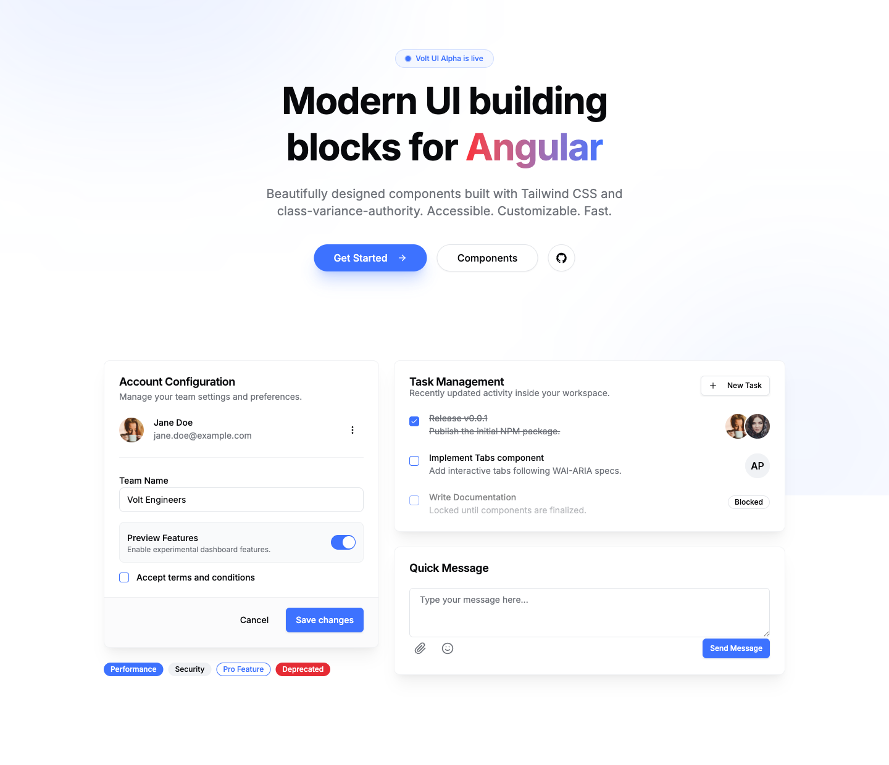

<div align="center">

<a href="https://volt-ui.andersseen.dev">
  <picture>
    <source media="(prefers-color-scheme: dark)" srcset="./docs/hero-dark.png" />
    <source media="(prefers-color-scheme: light)" srcset="./docs/hero-light.png" />
    
  </picture>
</a>

<h1>⚡ Volt UI</h1>

### Modern UI building blocks for Angular

Copy-and-own Angular components built on **signals**, **Tailwind CSS v4**, **CVA**,<br/>
and [ng-primitives](https://ng-primitives.dev) — accessible, themeable, and yours to edit.

<br/>

### 🎉 v1.0 is here

**42 components. API locked. Semver from here on out.**

After nine `0.x` minors, the public surface is frozen for the whole `1.x` line — inputs,
outputs and selectors won't move under you again outside a major.<br/>
See the **[release notes](./CHANGELOG.md)** · **[migration guide](./MIGRATION.md)** ·
**[versioning policy](https://volt-ui.andersseen.dev/docs/versioning)**

<br/>

[](https://www.npmjs.com/package/@voltui/components)
[](https://www.npmjs.com/package/@voltui/cli)
[](https://angular.dev)
[](https://tailwindcss.com)

[](https://volt-ui.andersseen.dev/docs/components)
[](https://github.com/Andersseen/volt-ui/actions/workflows/ci.yml)
[](./LICENSE)
[](https://github.com/Andersseen/volt-ui/stargazers)

<br/>

**[🌐 Live Docs](https://volt-ui.andersseen.dev)** · **[📦 Components](https://volt-ui.andersseen.dev/docs/components)** · **[🎨 Theme Builder](https://volt-ui.andersseen.dev/create-theme)** · **[🤖 AI / MCP](https://volt-ui.andersseen.dev/api/mcp)** · **[📖 Docs](https://volt-ui.andersseen.dev/docs/introduction)**

</div>

---

## 💡 What is Volt UI?

Volt UI is an independent Angular component library **inspired by [shadcn/ui](https://ui.shadcn.com)** — not a closed, versioned dependency you install and hope stays out of your way, but a **source-ownership workflow**:

```bash
npx @voltui/cli add button
```

- 📥 The CLI **copies the component source** into your project.
- ✍️ The copied files **become your code** — edit markup, styles, behavior, variants.
- 🎨 Restyle through **Tailwind v4 tokens** instead of fighting a theming API.
- 📦 Reach for the npm package **only** when you deliberately want shared themes/utilities.

> **Why it exists** — Angular has strong headless and enterprise UI options, but few focused on the shadcn-style _"copy the component and own it"_ workflow. Volt UI fills that gap with modern Angular 21 patterns: standalone components, `OnPush`, signals, zoneless compatibility, `ng-primitives` accessibility behavior, and Tailwind v4 tokens.

> _Naming note: this project is not affiliated with PrimeVue Volt UI. Here, Volt UI is an independent Angular implementation for the `@voltui` packages and CLI._

---

## ✨ Highlights

|                                |                                                                                             |
| ------------------------------ | ------------------------------------------------------------------------------------------- |
| ⚡ **Copy, don't couple**      | CLI copies source into your app — no lock-in, no black-box updates.                         |
| ♿ **Accessible by default**   | Keyboard, focus, and ARIA behavior delegated to [ng-primitives](https://ng-primitives.dev). |
| 🎨 **25 theme combinations**   | 5 color × 5 style presets, plus dark mode, driven by Tailwind v4 tokens.                    |
| 🧩 **42 components**           | Forms, overlays, navigation, data display — see the [full catalog](#-component-catalog).    |
| 🛰️ **Zoneless & signal-first** | `input()` / `output()` / `model()` / `computed()`, `OnPush` everywhere.                     |
| 🤖 **AI-ready**                | Ships an MCP server, a skill, and a prompt reference so assistants use it correctly.        |

---

## 🚀 Quick Start

Initialize a local UI folder, then add components:

```bash
# Scaffold ./src/app/ui
npx @voltui/cli init

# Add components (dependencies are copied automatically)
npx @voltui/cli add button card dialog
```

Use the copied components from your app:

```ts
import { UiButton } from './ui/button';

@Component({
  selector: 'app-example',
  imports: [UiButton],
  template: `<ui-button>Save</ui-button>`,
})
export class ExampleComponent {}
```

<details>
<summary><b>🛠️ CLI behavior & flags</b></summary>

<br/>

- Copies from `projects/volt/src/lib` into `src/app/ui` by default.
- Transforms `Volt*` → `Ui*` and `volt-*` → `ui-*`.
- Detects and copies local component dependencies automatically.
- Refuses to overwrite existing files unless `--force` is passed.
- `--dry-run` previews files before writing.
- `[target-dir]` sets an alternate destination.
- `--install` installs the required runtime dependencies.

```bash
npx @voltui/cli add button card ./src/app/shared/ui --dry-run
npx @voltui/cli add button card ./src/app/shared/ui --force --install
```

Copied components need these runtime dependencies in the target app:

```bash
npm install ng-primitives class-variance-authority clsx tailwind-merge
```

</details>

---

## 🎨 Theme System

Themes are CSS custom properties mapped into Tailwind v4 via `@theme inline`. Components use **semantic utilities** (`bg-primary`, `text-foreground`, `rounded-md`, `shadow-sm`) instead of hard-coded `var()` utilities — so a preset swap restyles everything.

<table>
<tr>
<td valign="top" width="50%">

**🌈 Color presets**

- `volt`
- `ember`
- `sage`
- `dusk`
- `glacier`

</td>
<td valign="top" width="50%">

**🖌️ Style presets**

- `sharp`
- `soft`
- `brutal`
- `ghost`
- `retro`

</td>
</tr>
</table>

> 🎛️ Mix and match live in the **[Theme Builder →](https://volt-ui.andersseen.dev/create-theme)** — generate a
> contrast-checked palette in one click, or import one from
> [Palette Crafter](https://palette-crafter.andersseen.dev).

---

## 🧩 Component Catalog

**42 components** across every common surface — which is, of course, the Answer to the
Ultimate Question of Life, the Universe, and Everything. 🐋 The v1 surface is now fixed and
every component is labeled `stable` or `beta` — see
**[COMPONENT_STATUS.md](./COMPONENT_STATUS.md)**.

<sub>Deep Thought needed 7½ million years to arrive at 42. We needed nine <code>0.x</code>
minors, which is arguably worse. Don't panic: shipping a 43rd component in some future
minor will ruin this joke, and we've made peace with that.</sub>

<details open>
<summary><b>Browse all components</b></summary>

<br/>

| Category             | Components                                                                                                                                                                                                             |
| -------------------- | ---------------------------------------------------------------------------------------------------------------------------------------------------------------------------------------------------------------------- |
| **Forms & inputs**   | `input` · `textarea` · `checkbox` · `radio` · `select` · `combobox` · `listbox` · `switch` · `slider` · `toggle` · `toggle-group` · `input-otp` · `form-field` · `autofill` · `file-upload` · `date-picker` · `search` |
| **Actions**          | `button` · `toolbar`                                                                                                                                                                                                   |
| **Overlays**         | `dialog` · `drawer` · `popover` · `tooltip` · `dropdown-menu` · `toast`                                                                                                                                                |
| **Navigation**       | `navigation-menu` · `breadcrumbs` · `pagination` · `tabs` · `accordion`                                                                                                                                                |
| **Data display**     | `table` · `avatar` · `badge` · `card` · `meter` · `progress` · `skeleton` · `separator`                                                                                                                                |
| **Layout & utility** | `resizable` · `sidebar` · `theme`                                                                                                                                                                                      |

</details>

---

## 📦 Optional Package Usage

The `@voltui/components` package exists for themes, utilities, and advanced consumers who deliberately want package-owned imports. It is **not** the default for teams who want source ownership.

```bash
npm install @voltui/components
```

Import themes once — that single line is all Tailwind v4 needs:

```css
@import 'tailwindcss';
@import '@voltui/components/themes.css';
```

The theme CSS self-registers the compiled component bundle as a `@source`, so every utility class the components use is generated automatically. It also aligns Tailwind's `dark:` variant with the `.dark` class Volt toggles.

Provide a theme at bootstrap:

```ts
import { provideVoltTheme } from '@voltui/components';

bootstrapApplication(AppComponent, {
  providers: [provideVoltTheme({ color: 'volt', style: 'sharp', dark: false })],
});
```

---

## 🤖 AI Tools for Consumers

Volt UI ships three complementary ways to give AI assistants correct context:

| Tool                    | What it is                                                                                           | Install                                              |
| ----------------------- | ---------------------------------------------------------------------------------------------------- | ---------------------------------------------------- |
| 🧠 **Skill**            | Auto-discovered by Claude Code / OpenCode in a workspace                                             | `npx volt-ui-mcp claude`                             |
| 🛰️ **MCP server**       | `list_components`, `get_component`, `get_usage_example`, `get_theme_info`, `generate_cli_command`, … | [`/api/mcp`](https://volt-ui.andersseen.dev/api/mcp) |
| 📋 **Prompt reference** | Single file to paste into any LLM chat                                                               | [`VOLT_UI_PROMPT.md`](./VOLT_UI_PROMPT.md)           |

---

## 📈 Stability & Roadmap

Current status: **`1.0.1` — stable. The public API is locked.**

Component inputs, outputs, and selectors follow semantic versioning as of `1.0.0`:
breaking changes only happen in a major version bump, new features land in minors, and
fixes land in patches. If you're upgrading from a `0.x` release, see
**[MIGRATION.md](./MIGRATION.md)** for the full 0.x → 1.0 upgrade guide (the three
aliases it documents as removed in 1.0.0 are gone as of this release) and
**[specs/api-freeze-0.9.md](./specs/api-freeze-0.9.md)** for the frozen pre-1.0 API
reference this release shipped against.

- **Stable** — recommended for production use.
- **Beta** — usable; may still gain forms / keyboard / a11y / edge-case coverage before
  moving to stable, but its public API won't change outside a major bump.
- **Experimental** — reserved for future previews. Not currently used — every shipped
  component is `stable` or `beta` as of `1.0.0`.

All components remain available through the package and CLI; the status label
communicates **confidence, not availability**. See
**[docs/versioning](https://volt-ui.andersseen.dev/docs/versioning)** for the full
semver promise and support policy.

Full status table: **[COMPONENT_STATUS.md](./COMPONENT_STATUS.md)**.

### Compatibility policy

The `1.x` line targets Angular `^21.2` and Node 20 or newer. Volt UI supports the
latest declared Angular major only; widening that range requires consumer-fixture
verification and is never assumed from a successful build. Each supported Angular
major is documented with migration notes or release notes before a major is dropped.

Coverage is measured against the complete library source, CLI core and hosted
MCP route. Every component family requires a real behavior spec, while overlays
and keyboard workflows are additionally exercised in Playwright.

---

## 🛠️ Development

```bash
pnpm install        # install dependencies
pnpm dev            # docs app (AnalogJS + Vite)
pnpm typecheck      # type check
pnpm lint           # lint
pnpm test:run       # unit tests (Vitest)
pnpm build:lib      # build the Angular library
pnpm test:e2e:ci    # Playwright e2e
pnpm manifest       # regenerate the CLI manifest after component changes
```

CI and deployment run through a **single pipeline** (`.github/workflows/ci.yml`): every PR runs lint · typecheck · test · build · e2e, and a merge to `main` deploys the docs to **Cloudflare Pages**.

See [CONTRIBUTING.md](./CONTRIBUTING.md) and [AGENTS.md](./AGENTS.md) for conventions.

---

<div align="center">

Built with ⚡ by [Andersseen](https://github.com/Andersseen) · [MIT License](./LICENSE)

**[🌐 volt-ui.andersseen.dev](https://volt-ui.andersseen.dev)**

<sub><a href="#-volt-ui">↑ Back to top</a></sub>

</div>
